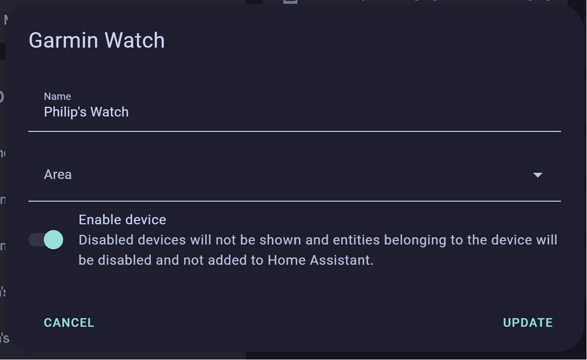
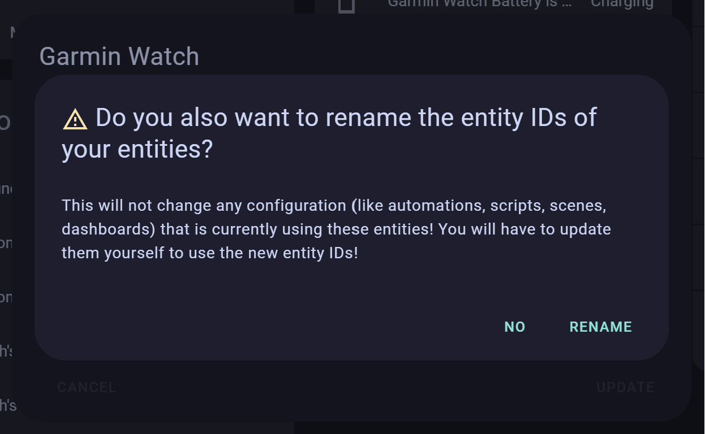

[Home](README.md) | [Switches](examples/Switches.md) | [Actions](examples/Actions.md) | [Templates](examples/Templates.md) | [Numeric](examples/Numeric.md) | [Glance](examples/Glance.md) | [Background Service](BackgroundService.md) | [Wi-Fi](Wi-Fi.md) | [HTTP Headers](HTTP_Headers.md) | [Trouble Shooting](TroubleShooting.md) | [Version History](HISTORY.md)

# Background Service

The background service can report the following statuses from your device to your HomeAssistant:

- Battery Level with charging status.
- Location and location accuracy.
- Activity information, but only if your device supports API level 3.2.0. If your device does not support this API level, this information is simply omitted. How do you know? Easiest way is to see if the data is reported.

If your device does not support the background service, the application will clear this setting after you have enabled it. This tells you that you are unable to take advantage of the background reporting service for the functions below.

## Limits

The values are merely samples of your device's current status. They are sent by a single background service at the repetition frequency you chose in the settings. The samples are sent at that one rate only, they _do not vary_ for example on in activity, on charge, time of day. You get one refresh interval and that is it. If you want to change the refresh interval, you change your settings. We do appreciate that may not be what you would ideally like to trigger actions on HomeAssistant. Messing with the repeat interval of the background service requires more code, more settings and more complexity. That means older devices using widgets would have to be taken out of support to achieve it.

**Please do not ask for these to be made 'events'.** Garmin's [Connect IQ background service](https://developer.garmin.com/connect-iq/api-docs/Toybox/System/ServiceDelegate.html) is limited in that while it does provide an `onActivityCompleted()` method, it does not provide an `onActivityStarted()` method, so you would not have the complete activity life cycle anyway. So we're keeping this implementation simple, you just get a sampling at one refresh rate. This probably limits you to updating a status on a HomeAssistant Dashboard only.

## Battery Reporting

From version 2.1 the application includes a background service to report the current device battery level and charging status back to HomeAssistant. This is a feature that Garmin omitted to include with the Bluetooth connection.

## Location Reporting

From version 2.6 the application includes reporting your location. The location data reported includes:

- Location (latitude and longitude)
- Location accuracy
- Speed
- Direction
- Altitude

You get whatever your device provides at the moment, i.e. at the accuracy the device currently provides. If your watch is not calibrated you get poor data. It might mean that you get more accurate location data when you are in a location tracking activity (i.e. not swimming pool lengths). The device [indicates an accuracy](https://developer.garmin.com/connect-iq/api-docs/Toybox/Position.html#Quality-module) in units of:

- `Position.QUALITY_NOT_AVAILABLE` - No update provided
- `Position.QUALITY_LAST_KNOWN` - No update provided
- `Position.QUALITY_POOR` - We translate that to 500 m arbitrarily
- `Position.QUALITY_USABLE` - We translate that to 100 m arbitrarily
- `Position.QUALITY_GOOD` - We translate that to 10 m arbitrarily

**You cannot rely on the radius of the circle of accuracy in any resulting maps as any meaningful indication of error.**

## Activity Reporting

From version 2.6 the application includes reporting your activity. The activity data includes:

- Activity - This is an integer as defined by [Toybox.Activity `SPORT`](https://developer.garmin.com/connect-iq/api-docs/Toybox/Activity.html#Sport-module)
- Sub-activity - This is an integer as defined by [Toybox.Activity `SUB_SPORT`](https://developer.garmin.com/connect-iq/api-docs/Toybox/Activity.html#SubSport-module)

The application only provides the integers without translation. When using the values in HomeAssistant, you will need to provide you own mapping from the `Activity` enumerated type to the human readable text. As developers of the application we are pushing this translation to the server to keep the Garmin application code 'lean'. You will also need to add to both the list of activities (sports) and sub-activities (sub-sports) an interpretation of integer `-1` for no activity/sub-activity at present.

## Start Reporting

The main drawback of this solution is that the Garmin application must be run once with the feature enabled in the settings before reporting will start. Reporting continues after you have exited the application. This is a limit we cannot code around.

It should be as simple as starting the application (or widget). There should be a new device in the mobile app integration called `Garmin Watch` with the battery level and charging status.

[](https://my.home-assistant.io/redirect/integration/?domain=mobile_app)

If this is not the case, head over to the [troubleshooting page](Troubleshooting.md#watch-battery-level-reporting).

## Stop Reporting

To stop the reporting, the option must be turned off in the settings and then the application run once. Running the application then removes the background service. Both the enable and repeat time settings can be changed whilst the application is running (i.e. live) and the background service will be amended.

## Renaming the device

When the device is first created, it will be called `Garmin Watch`. This can be changed in the mobile app integration settings (button below).

[](https://my.home-assistant.io/redirect/integration/?domain=mobile_app)

Select the device called `Garmin Watch` and then click on the edit icon in the top right corner. You can then change the name of the device to whatever you like, then press `UPDATE` and then `RENAME`.





## Fixing the icon

In `configuration.yaml`:

```yaml
template:
  - sensor:
      - name: "<device-name> Battery Level"
        unique_id: "<unique-id>"
        device_class: "battery"
        unit_of_measurement: "%"
        state_class: "measurement"
        state: "{{ states('sensor.<device>_battery_level') }}"
        icon: "mdi:battery-charging-{{ (states('sensor.<device>_battery_level') | float / 10 ) | round(0) * 10 }}-outline-100"
```

## Adding a sample HomeAssistant UI widget

A gauge for battery level with a charging icon making use of [mushroom cards](https://github.com/piitaya/lovelace-mushroom), [card_mod](https://github.com/thomasloven/lovelace-card-mod) and [stack-in-card](https://github.com/custom-cards/stack-in-card):


In lovelace:

```yaml
type: custom:stack-in-card
direction: vertical
cards:
  - type: custom:mushroom-chips-card
    card_mod:
      style: |
        ha-card {
          height: 0.25rem;
        }
    chips:
      - type: conditional
        conditions:
          - condition: state
            entity: binary_sensor.<device>_battery_is_charging
            state: "on"
        chip:
          type: entity
          icon_color: yellow
          entity: sensor.<device>_battery_level
          content_info: none
          use_entity_picture: false
          card_mod:
            style: |
              ha-card {
                border: none !important;
              }
      - type: conditional
        conditions:
          - condition: state
            entity: binary_sensor.<device>_battery_is_charging
            state: "off"
        chip:
          type: entity
          entity: sensor.<device>_battery_level
          content_info: none
          use_entity_picture: false
          card_mod:
            style: |
              ha-card {
                border: none !important;
              }
  - type: gauge
    entity: sensor.<device>_battery_level
    unit: "%"
    name: Watch
    needle: false
    severity:
      green: 50
      yellow: 20
      red: 0
    card_mod:
      style: |
        ha-card {
          border: none !important;
        }
```

N.B. `sensor.<device>_battery_level` will likely need to be changed to `sensor.<device>_battery_level_2` if you have fixed the icon as above.

## Migrating

You should remove your old template sensors before migrating to the new integration. You can do this by removing the `sensor.<device>_battery_level` and `binary_sensor.<device>_battery_is_charging` entities from `configuration.yaml` and then restarting HomeAssistant or reloading the YAML.

[Here is the old configuration method for reference.](https://github.com/house-of-abbey/GarminHomeAssistant/blob/b51e2aa2a4afbc58ad466f3b81667d1cd252d091/BatteryReporting.md)

## Deletion

While all of the entries have the same name, you can identify which to delete by clicking through to its device which should have a changed name from when it was set up.


