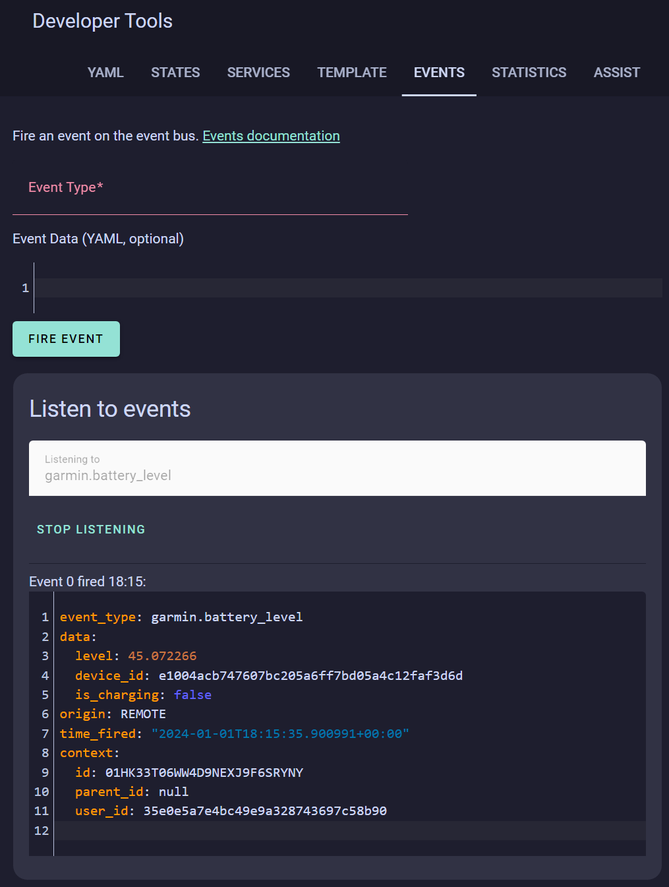

# Battery Reporting

From version 2.1 the application includes a background service to report the current device battery level and charging status back to Home Assistant. This is a feature that Garmin omitted to include with the Bluetooth connection.

## Start Reporting

The main drawback of this solution is that the Garmin application must be run once with the feature enabled in the settings before reporting will start. Reporting continues after you have exited the application. This is a limit we cannot code around.

## Stop Reporting

To stop the reporting, the option must be turned off in the settings and then the application run once. Running the application then removes the background service.

In both cases, the enable and repeat time settings can be changed whilst the application is running (i.e. live) and the background service will be amended.

## Listening for the `device_id`



```yaml
event_type: garmin.battery_level
data:
  level: 45.072266
  device_id: e1004acb747607bc205a6ff7bd05a4c12faf3d6d
  is_charging: false
origin: REMOTE
time_fired: "2024-01-01T18:15:35.900991+00:00"
context:
  id: 01HK33T06WW4D9NEXJ9F6SRYNY
  parent_id: null
  user_id: 35e0e5a7e4bc49e9a328743697c58b90
```

The `device_id` is consistent for our purposes. It does change between devices and also between the 'application' and 'widget' installations. Different device model simulators also vary the `device_id`. Here we want to extract `e1004acb747607bc205a6ff7bd05a4c12faf3d6d` for use in the sample YAML `trigger` above.

## Setting up the trigger to update the entity

The watch will send HTTP requests to HomeAssistant every 5+ minutes in a background service. The events produced by the HTTP requests can be listened for with a template entity. In this case we have two (battery level and is charging).

```yaml
  - trigger:
      - platform: "event"
        event_type: "garmin.battery_level"
        event_data:
          device_id: "<device-id>"
    sensor:
      - name: "<device-name> Battery Level"
        unique_id: "<uid-0>"
        device_class: "battery"
        unit_of_measurement: "%"
        state_class: "measurement"
        state: "{{ trigger.event['data']['level'] }}"
        icon: mdi:battery-charging-{{ (trigger.event['data']['level'] | float / 10 ) | round(0) * 10 }}-outline-100
        attributes:
          device_id: "<device-id>"
  - trigger:
      - platform: "event"
        event_type: "garmin.battery_level"
        event_data:
          device_id: "<device-id>"
    binary_sensor:
      - name: "<device-name> is Charging"
        unique_id: "<uid-1>"
        device_class: "battery_charging"
        state: "{{ trigger.event['data']['is_charging'] }}"
        attributes:
          device_id: "<device-id>"
```

1. Copy this yaml to your `configuration.yaml`.
2. Swap `<device-name>` for the name of your device (This can be anything and is purely for the UI). Swap `<uid-0>` and `<uid-1>` for two different unique identifiers (in the Studio Code Server these can be generated from the right click menu).
3. Open the [event dashboard](https://my.home-assistant.io/redirect/developer_events/) and start listening for `garmin.battery_level` events and when your recieve one copy the device id and replace `<device-id>` with it (to speed up this process you can close and reopen the GarminHomeAssistant app).
4. Restart HomeAssistant or reload the YAML [here](https://my.home-assistant.io/redirect/server_controls/).

## Adding a sample Home Assistant UI widget

## TODO: YAML for a dashboard
