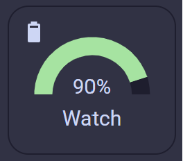

# Battery Reporting

From version 2.1 the application includes a background service to report the current device battery level and charging status back to Home Assistant. This is a feature that Garmin omitted to include with the Bluetooth connection.

## Start Reporting

The main drawback of this solution is that the Garmin application must be run once with the feature enabled in the settings before reporting will start. Reporting continues after you have exited the application. This is a limit we cannot code around.

It should be as simple as that, there should be a new device in the mobile app integration called `Garmin Watch` with the battery level and charging status.

[](https://my.home-assistant.io/redirect/integration/?domain=mobile_app)

If this is not the case, head over to the [troubleshooting page](Troubleshooting.md#watch-battery-level-reporting).

## Stop Reporting

To stop the reporting, the option must be turned off in the settings and then the application run once. Running the application then removes the background service.

In both cases, the enable and repeat time settings can be changed whilst the application is running (i.e. live) and the background service will be amended.

## Adding a sample Home Assistant UI widget

A gauge for battery level with a charging icon making use of [mushroom cards](https://github.com/piitaya/lovelace-mushroom), [card_mod](https://github.com/thomasloven/lovelace-card-mod) and [stack-in-card](https://github.com/custom-cards/stack-in-card):



```yaml
type: custom:stack-in-card
direction: vertical
cards:
  - type: custom:mushroom-chips-card
    card_mod:
      style: |
        ha-card {
          height: 0.25rem;
        }
    chips:
      - type: conditional
        conditions:
          - condition: state
            entity: binary_sensor.<device>_is_charging
            state: 'on'
        chip:
          type: entity
          icon_color: yellow
          entity: sensor.<device>_battery_level
          content_info: none
          use_entity_picture: false
          card_mod:
            style: |
              ha-card {
                border: none !important;
              }
      - type: conditional
        conditions:
          - condition: state
            entity: binary_sensor.<device>_is_charging
            state: 'off'
        chip:
          type: entity
          entity: sensor.<device>_battery_level
          content_info: none
          use_entity_picture: false
          card_mod:
            style: |
              ha-card {
                border: none !important;
              }
  - type: gauge
    entity: sensor.<device>_battery_level
    unit: '%'
    name: Watch
    needle: false
    severity:
      green: 50
      yellow: 20
      red: 0
    card_mod:
      style: |
        ha-card {
          border: none !important;
        }
```
