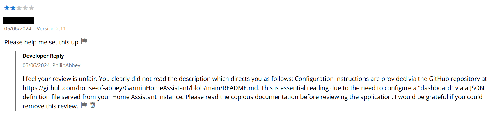
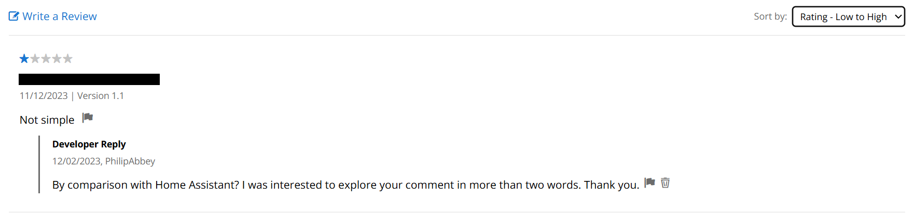
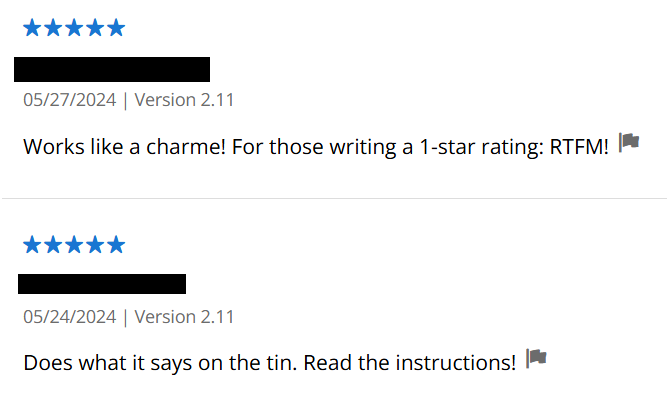
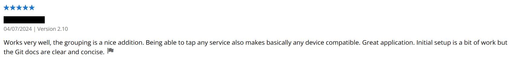
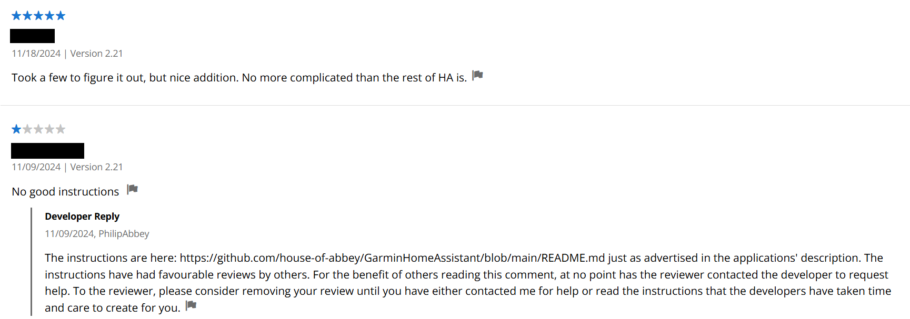
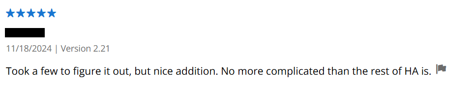
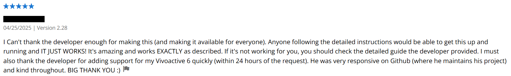
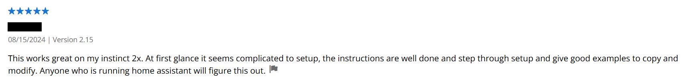
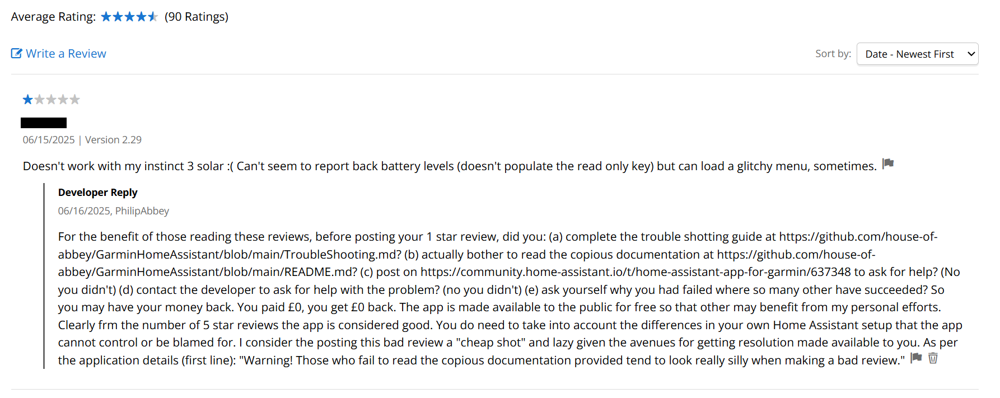

[Home](README.md) | [Switches](examples/Switches.md) | [Actions](examples/Actions.md) | [Templates](examples/Templates.md) | [Numeric](examples/Numeric.md) | [Glance](examples/Glance.md) | [Background Service](BackgroundService.md) | [Wi-Fi](Wi-Fi.md) | [HTTP Headers](HTTP_Headers.md) | [Trouble Shooting](TroubleShooting.md) | [Version History](HISTORY.md)

## Contents

* [Etiquette](#etiquette)
* [The software is free!](#the-software-is-free)
* [Read the instructions](#read-the-instructions)
* [Getting help (with a polite reply)](#getting-help-with-a-polite-reply)
* [Example support requests](#example-support-requests)
* LAQ - [_Lazily Asked Questions_](#lazily-asked-questions)
  * [Minimum user requirements](#minimum-user-requirements)
  * [API Keys](#api-keys)
  * [Connectivity](#connectivity)
  * [Menu definition](#menu-definition)
  * [Wi-Fi](#wi-fi)
  * [Setup Support](#setup-support)
* [Reviews "Hall of Fame"](#reviews-hall-of-fame)

# Etiquette

Thank you to all those who have provided positive feedback, code and language translations, you have made the product better. The majority of users that contact us are grateful and we thank you for your courtesy. Sadly not everyone is as reasonable or polite. What follows is what the authors consider reasonable behaviour from users. We are getting a sufficient number of examples that it feels like something has to be called out! There are some users who feel "entitled" to be discourteous, as evidences by some of the Garmin application reviews.

> [!IMPORTANT]
> **The intended audience for this application are those comfortable with configuring a HomeAssistant** (e.g. editing the YAML configuration files) and debugging why URLs don't work. It does not require programming skills, but the menu is configured via JSON which feels like "coding" (more like "describing"). If you are not comfortable with this relatively low level of configuration, you may like to try other Garmin applications instead.

> [!IMPORTANT]
> Remember, you are expecting to define a customised menu making use of several options using your Home Assistant's custom entities on a small (portable) device. **There is no "_simple_" way to configure the menu with the ever increasing options demanded by the user community.** Was your Home Assistant trivial to setup? No!
>
> Review comments like "_The setup is not trivial_" and "_Configuration is indeed not easy, unforgiving, and requires careful reading of the documentation_" fail to respect the enormity of the task you as a user are expecting to achieve for your own menu. Such comments are more a reflection of the user's disproportionately high expectation of a small watch (portable device) application with no mouse, no keyboard and a limited user interface, hence I hope you will agree they are poorly considered given the functionality that has been achieved. For the purposes of menu customisation, please reign your expectations in and _be realistic_.

Just because you didn't (originally) read this, does not excuse you from being civil (or not having read this).

## The software is free!

That means the habitual ["click & complain"](#reviews-hall-of-fame) behaviour some users assume is their right is inappropriate here. When the software is freely given without any form of fee (not even "Buy me a beer"), the users benefit not the developers.

1. **If you don't like the software don't use it. Simple.** You've not paid anything for it, so you have lost nothing and have nothing to complain about.

2. **If you do have a critical comment to make, be sure you are right!** Don't review in your ignorance something that is already covered by the detailed instructions, and perhaps you as the user have simply got wrong because you are too lazy to read them properly.

3. **If you are struggling, please contact the developers.** _Tell us which part of the instructions you are struggling with_. That will then help us to amend the instructions for the next person, and hence benefits the project as a whole.

4. Better still, please **contribute improvements**. This is an Open Source project, hence we can collaborate to make the project better for all (including the developers ;-)).

5. Do review the product, just make sure you are on safe ground please. E.g. the developers or project cannot accommodate your requirement and hence the product's deficiency is real (and explainable).

As we are not selling any products here, **we do not have to pander to customers**, you are users benefitting from our work for free. If we think you are too lazy to read the instructions we will tell you bluntly. If you publicly provide a scathing review based on your ignorance and failure to read the documentation provided, we feel entitled to call you out for others to see.

**_You have been warned._**

## Read the instructions

I know many of you can't be bothered. Tough! Then we can't be bothered to support you. Its our time you are wasting, and we're not getting paid. Remember we volunteer our time as part of our pay back to the [Home Assistant community](https://community.home-assistant.io/).

If your support request sent you to this section of this page then this is the part of the application's description you probably skipped over, the advertised instructions you were told you need to read.

> Configuration instructions are provided via the GitHub repository at https://github.com/house-of-abbey/GarminHomeAssistant/blob/main/README.md. This is essential reading due to the need to configure a "dashboard" via a JSON definition file served from your Home Assistant instance.

As one user recently said:

> _"Yes, the documentation is good. Yes, people will fail to read it. That’s life."_

That's not acceptable to the authors. The documentation is there so the developers do not have to spend their precious private time supporting users. When it is obvious you have failed to read the documentation, that's a reason to chastise and rebuke the user. Not least because it often leads on to publicly criticising the product for alleged failures that are simply just user errors. That causes reputational damage, and that is not acceptable to the authors.

As the application description says:

> Warning! Those who fail to read the copious documentation provided tend to look really silly when making a bad review (and we call you out by reply).

In short: Failure to read the instructions wastes the author's time, so we will be blunt with you.

## Getting help (with a polite reply)

1. Contact the application developers with your _question_. Explain where the documentation does not meet your needs or is unclear.

2. Include a reply email address, or we can't contact you. (Someone is currently assuming the developers couldn't be bothered to reply... :facepalm:)

3. Raise an [issue](https://github.com/house-of-abbey/GarminHomeAssistant/issues) so that we can consider a product development.

4. Start a discussion on [Home Assistant App for Garmin](https://community.home-assistant.io/t/home-assistant-app-for-garmin/637348) forum page. _Be careful_ not to make a false claim about the product, e.g. one that is caused by your own mistake, you are posting publicly and might get an unwelcome reply. Instead, post a query for confirmation or a suggestion. Leave yourself room to back down from any careless claims!

Please don't:

* Use reviews with a poor score to explain your issue, we will be less inclined to support you. The problem is usually user error and you won't return to amend your review. This will earn you a [scathing reply](#reviews-hall-of-fame) from the developers.

Best!

* Make changes to the documentation, language support or source code and submit a [pull request](https://github.com/house-of-abbey/GarminHomeAssistant/pulls) to merge into the product repository. The authors are delighted to have benefitted from talented users who have made the product better and now use those improvements themselves.

## Example support requests

There have been some excellent support requests that have led to new developments in the application. For example:

* The numeric menu item to pick a number. The email trail led to the user contributing new code on a pull request. Superb!
* Other requests were to support new Garmin devices that we had not kept up with. Thanks for that prompt.
* Also to support older devices that do not have sufficiently recent API support; the application requires API level 3.1, sorry.
* The lead on the GHA app only working when the "iPhone Connect IQ app" was open, a bug in the iPhone app.
* Notification of an application distribution issue as follows.

On Mon, 20 Jan 2025 at 21:15, <noreply@garmin.com> wrote:

> The Connect IQ user [redacted] has sent you the following request regarding your app "GarminHomeAssistant (Application)":
>
> Hallo,
>
> since the new version from today, 20.01.2025 I get the message, that the app is not available in my country.
>
> I'm located in Germany.
>
> best regards

On Sun, 2 Feb 2025 at 05:59, <noreply@garmin.com> wrote:

> The Connect IQ user [redacted] has sent you the following request regarding your app "GarminHomeAssistant (Application)":
>
> Error Garmin iq. This application is not available in you country.
> I am in France.

Between these two dates we had about 8 emails in total with this issue.

Answer: The developers got done over by Garmin, as explained more fully in [a post](https://community.home-assistant.io/t/home-assistant-app-for-garmin/637348/342?u=np_complete) on the Home Assistant forum under "Home Assistant App for Garmin". Very usefully, a user provided a temporary solution using a VPN to work around country restrictions. Superb! Without these reports the developers would have had no idea the distribution problem existed.

## _Lazily Asked Questions_

Here are the support requests the developers were less impressed by, and the answers. Note the replies are pretty consistent in theme.

* [Minimum user requirements](#minimum-user-requirements)
* [API Keys](#api-keys)
* [Connectivity](#connectivity)
* [Menu definition](#menu-definition)
* [Wi-Fi](#wi-fi)
* [Setup Support](#setup-support)

If you ever consider donating your own application to the public, you might want to be cautious about the support you will be expected to provide.

### Minimum user requirements

On Mon, 6 May 2024 at 09:01, <noreply@garmin.com> wrote:

> The Connect IQ user [redacted] has sent you the following request regarding your app "GarminHomeAssistant (Widget)":
>
> I can't use this

Answer: Make sure you meet the [minimum requirements for being a user](#etiquette) please! Provide more information on what the problem actually is. Clearly the support reply pointing to the documentation was either not read or not considered helpful, hence the point about meeting the minimum user requirements.

On Fri, 31 Oct 2025 at 11:45, <noreply@garmin.com> wrote:

> The Connect IQ user [redacted] has sent you the following request regarding your app "GarminHomeAssistant (Application)":
>
> I have a garmin venu 4 and I am trying to use my garmin watch to turn on and off smart plugs in my house using this > application
>
> would you be able to help me set this up as I have no idea how to do this?
>
> Thank you

Developer reply:

> We have spent a significant effort and time to create the support pages for this application. The application description at https://apps.garmin.com/apps/61c91d28-ec5e-438d-9f83-39e9f45b199d advertises the support mechanisms.
>
> That's https://github.com/house-of-abbey/GarminHomeAssistant/blob/main/README.md
>
> The README.md explains you are expected to be comfortable with configuring a Home Assistant:
>
> The intended audience for this application are those comfortable with configuring a HomeAssistant (e.g. editing the YAML configuration files) and debugging why URLs don't work.
>
> No we will not lead you hand-in-hand through the setup of your own menu. If you can't cope with this requirement you are using the wrong application! We made the application available for free for others to benefit. That's a lot of our time taken up. We have no time left for those you are unwilling or unable to read the instructions. Sorry!
>
> Please help yourself in the first instance, and come back with a more insightful request for help demonstrating you have made an effort. Also note the existence of https://github.com/house-of-abbey/GarminHomeAssistant/blob/main/TroubleShooting.md to try and solve problems.

User reply:

> Thank you for being so unhelpful 🙂

Developer reply:

> You are asking me to dedicate my limited personal time to your personal inability to follow our existing instructions. We have delivered the support as published instructions - use it! We've done our bit for the free application we have given you. Will you not even attempt to help yourself? If you can't help yourself how will you support your own use into the future? Do you expect me to be at your beck and call? That was never part of the deal for giving our application to the public. I even took the time to reply to your (lazy) email.

User reply:

> You need help mate.
>
> Your instructions are geared towards software developers and not the average person. I don't know how to write code!!
>
> Good luck

Developer reply:

> Then clearly they are geared towards the intended audience then! Did you not understand this bit?
>
> > The intended audience for this application are those comfortable with configuring a HomeAssistant (e.g. editing the YAML configuration files) and debugging why URLs don't work.
>
> You need a different application. Try this one instead: https://apps.garmin.com/en-US/apps/3dce2242-473f-4f13-a6a9-299c3686611f
>
> **You are also rude.** At least I was courteous in explaining why I would not dedicate my free time to your personal endeavour. And now I have found you an alternative application. Please be courteous when asking so much of others, and understanding when they explain why they won't do as you ask.

Answer: Make sure you meet the [minimum requirements for being a user](#etiquette) please!

(This last email trail does beg the question how this user ever expected to be able to work with their own Home Assistant server...)

---

### API Keys

On Sat, 26 Jul 2025 at 10:47, <noreply@garmin.com> wrote:

> The Connect IQ user [redacted] has sent you the following request regarding your app "GarminHomeAssistant (Application)":
>
> bonjour.
> impossible de ce connecter à l'api . http://192.168.0.x:8123

Answer: Please read the documentation about [use of HTTPS](https://github.com/house-of-abbey/GarminHomeAssistant?tab=readme-ov-file#no-https).

On Wed, 8 Oct 2025 at 15:20, <noreply@garmin.com> wrote:

> The Connect IQ user [redacted] has sent you the following request regarding your app "GarminHomeAssistant (Application)":
>
> co to jest klucz API

> On Thu, 18 Dec 2025 at 13:44, <noreply@garmin.com> wrote:
>
> The Connect IQ user [redacted] has sent you the following request regarding your app "GarminHomeAssistant (Widget)":
>
> when asked for the api code, is that from the router, or where can I find it?

> On Sun, 28 Dec 2025 at 10:51, <noreply@garmin.com> wrote:
>
> The Connect IQ user [redacted] has sent you the following request regarding your app "GarminHomeAssistant (Application)":
>
> bonjour
>
> qu'est ce l API  ?

Answer: Please read the documentation about [API Key Creation](https://github.com/house-of-abbey/GarminHomeAssistant?tab=readme-ov-file#api-key-creation).

---

### Connectivity

On Tue, 1 Jul 2025 at 10:56, <noreply@garmin.com> wrote:

> The Connect IQ user [redacted] has sent you the following request regarding your app "GarminHomeAssistant (Application)":
>
> it always says it's can't find the internet but the phone is connected to the internet and the watch is connected to the internet. help

Answer: Please read the documentation in the [trouble shooting guide](TroubleShooting.md).

---

### Menu definition

> On Sat, 6 Dec 2025 at 07:49, <noreply@garmin.com> wrote:
>
> The Connect IQ user [redacted] has sent you the following request regarding your app "GarminHomeAssistant > (Application)":
>
> Bonjour,
>
> J'ai mis le token, l'URL duckdns par laquelle j'accède à HA et l'URL du json .
> Le json est {} et est accessible via Chrome de mon tél.
>
> L'appli tourne en boucle après ce paramétrage.
>
> Que puis-je faire pour identifier le problème ?
>
> Merci

On Tue, 9 Dec 2025 at 11:11, <noreply@garmin.com> wrote:

> The Connect IQ user [redacted] has sent you the following request regarding your app "GarminHomeAssistant (Application)":
>
> Good morning
>
> Thank you for this application.
>
> I have put as application paramètres
> - the HA long term token
> - url to access HA (duckdns)
> - url to accessvm the json file
>
> The json file is : {}
> I can access the json file through my web browser.
>
> When I enter hhise paramétrer on your appli, I enter in a kind of loop.
>
> show can I progress : log in m'y watch, m'y phone, m'y pc, my HA ?
>
> Thanks

Answer: Please read the documentation about [Dashboard Definition](https://github.com/house-of-abbey/GarminHomeAssistant?tab=readme-ov-file#dashboard-definition).

---

### Wi-Fi

On Thu, 30 Oct 2025 at 13:56, <noreply@garmin.com> wrote:

> The Connect IQ user [redacted] has sent you the following request regarding your app "GarminHomeAssistant > (Application)":
>
> Hello,
>
> will app work if there is Garmin LTE connected for Fenix 8 Pro but no phone connection ower BT?

Answer: Please read the documentation about [Wi-Fi support](https://github.com/house-of-abbey/GarminHomeAssistant/blob/main/Wi-Fi.md).

---

### Setup Support

On Sun, 4 Feb 2024 at 02:19, <noreply@garmin.com> wrote:

> The Connect IQ user [redacted] has sent you the following request regarding your app "GarminHomeAssistant (Widget)":
>
> How does this app work? Does it connect with Google Home or Alexa?

Answer: No, it connects with Home Assistant.

On Thu, 16 Jan 2025 at 12:02, <noreply@garmin.com> wrote:

> The Connect IQ user [redacted] has sent you the following request regarding your app "GarminHomeAssistant (Application)":
>
> Hola, me sale “ fallo en configuración API”

On Fri, 13 Jun 2025 at 16:59, <noreply@garmin.com> wrote:

> The Connect IQ user [redacted] has sent you the following request regarding your app "GarminHomeAssistant (Widget)":
>
> bonjour certains désordre sur ce GPS Garmin Explorer malgré les mises à jour.
Cordialement [redacted]

On Thu, 24 Jul 2025 at 17:35, <noreply@garmin.com> wrote:

> The Connect IQ user [redacted] has sent you the following request regarding your app "GarminHomeAssistant (Application)":
>
> ‏التطبيق لا يعمل على الساعة

On Thu, 11 Sept 2025 at 15:45, <noreply@garmin.com> wrote:

> The Connect IQ user [redacted] has sent you the following request regarding your app "GarminHomeAssistant (Application)":
>
> Ça ne marche pas

Answer:

1. Read the [instructions](README.md) and [trouble shooting guide](TroubleShooting.md) as advertised.

2. Provide enough information to diagnose a problem.

_"If you were expecting the setup to be like a Windows programme using points & clicks then you will sadly be disappointed. As the instructions make quite clear, this app is aimed at people who are comfortable configuring Home Assistant. If you are not happy writing a JSON text file, you may need to look for another application."_

_"The above simply is not enough to go on. You need to help me identify your problem. What have you tried so far? If you just ran the application and expected a fully populated menu with all your home entities, then that would be alarming right?"_

On Tue, 7 Oct 2025 at 19:56, <noreply@garmin.com> wrote:

> The Connect IQ user [redacted] has sent you the following request regarding your app "GarminHomeAssistant (Application)":
>
> Es ist unmöglich die App zum laufen zu bringen, auch nach 3 Stunden und KI Hilfe lein Erfolg. Die json kann ich im Browser aufrufen, die App sagt api okay, Menü Prüfe, mehr schaffe ich nicht. Garmin Fenix8

Pleasingly, this person contacted us for support rather than complaining publicly.

Answer: Please confirm you have read through the troubleshooting guide at https://github.com/house-of-abbey/GarminHomeAssistant/blob/main/TroubleShooting.md. You have not given me any symptoms with which to diagnose your issue. Please be assured that others have managed to get this application working on a wide variety of watches.

## Reviews "Hall of Fame"

Some of the following have earned their place in the review hall of fame, some for their "click & complain" attitude, including reviews without raising their issues to the developer for an [opportunity to help](#getting-help-with-a-polite-reply). Others for being helpfully realistic about the setup given the [remarks at the start of the page](#etiquette) about the complexity of what you are trying to achieve. These are in contrast to the complaints. Just be polite as the [software is free](#the-software-is-free), you've lost nothing!

How did this user ever set up a Home Assistant server?

Here are some contrasting reviews on the configuration.

Good advice.

Don't get an embarrassing retort, I call out those who "click & complain" without attempting to get their issue resolved.

Two words. Perhaps too lazy to consider why others gave rave reviews and ponder what he was doing wrong? Perhaps did not consider there might be some documentation to assist or support routes (subject to [getting a polite reply](getting-help-with-a-polite-reply))?

Blaming the wrong application. Just rude. Please get your facts straight. And it was such a simple workaround for the Garmin Connect IQ app bug.

s