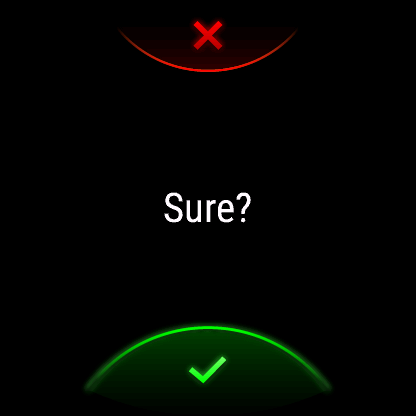

[Home](README.md) | [Switches](examples/Switches.md) | [Actions](examples/Actions.md) | [Templates](examples/Templates.md) | [Background Service](BackgroundService.md) | [Trouble Shooting](TroubleShooting.md) | Version History

# Version History

| Version | Comment |
|:-------:|---------|
|   1.0   | Initial release for 26 devices. |
|   1.1   | Updated for 54 more devices, 80 in total. Scene support. Added vibrate acknowledgement for tap-based menu items. Falls back to a custom visual confirmation in the absence of 'toast' and vibrate support. Bug fix for large menus needing status updates. |
|   1.2   | Do not crash on zero items to update. Report unreachable URLs. Verify API URL does not have a trailing slash '/'. Increased HTTP response diagnosis. Reduced minimum API Level required from 3.3.0 to 3.1.0 to allow more device "part numbers" to be satisfied. |
|   1.3   | Tap for scripts was working in emulation but not on some phones. Decision is to make the 'service' field in the JSON compulsory for 'tap' menu items. This is a breaking change, but for many might be a fix for something not working correctly. Improve language support, we can now accept language corrections and prevent the automated translation of strings from clobbering manually refined entries. Thank you to two new contributors. |
|   1.4   | New lean user Interface with thanks to [Someone0nEarth](https://github.com/Someone0nEarth) for their contribution which is now the default. If you prefer the old style you can still select it in the settings. The provision of a 'service' tag is now not just heavily suggested by the JSON schema, it is enforced in code. With apologies to anyone suffering a breakage as a result. |
|   1.5   |  Added an optional confirmation dialogue view to prevent accidental execution of actions on mistaken tap. This also brings a change in the JSON schema to allow an optional field to specify that the confirmation should be used for a menu item. As we are now maturing and adding features we have decided to mitigate breaking changes to the JSON schema by being more careful to adopt the Home Assistant schema (noting there is a 1:1 mapping between YAML and JSON). This change does deprecate the top level `service` tag in favour of `tag_action` containing multiple fields including `service` & `confirm`. Users should migrate to the new format for the new functionality, but the timescale for actual deprecation are long and undecided. |
|   1.6   | Added a user configurable 'timeout' in seconds so that when no action is taken the application automatically closes, stopping the continuous polling for changes of status and hence saving the drain on the battery. This can be disabled with timeout=0. |
|   1.7   | Added timeout to confirmation views so that when used for security devices it does not linger when left unconfirmed. Thanks to [Jan Schneider](https://github.com/j-a-n) for the contribution. Known bug for devices not supporting [`WatchUi.getCurrentView()`](https://developer.garmin.com/connect-iq/api-docs/Toybox/WatchUi.html#getCurrentView-instance_function) API call which is only available on API Level 3.4.0, e.g. Vivoactive 4S. |
|   2.0   | A significant code base change to enable both a 'widget' version for older devices, e.g. Venu (1), and an application with a glance, e.g. Venu2. These two versions must now be distributed under separate application IDs, but they have the same code base. A further 20 more devices are now supported, the settings have been internationalised, and there's a bug fix for older devices when trying to display a helpful error message but instead the application crashed. This version has come from a significant collaboration with [Someone0nEarth](https://github.com/Someone0nEarth). |
|   2.1   | Deployment of an idea to provide Home Assistant with access to the watch battery level. Using this requires [significant setup](BackgroundService.md) on the Home Assistant configuration and hence is detailed separately. Due to this, the default state for this battery option is _off_. Changed the application settings user interface to be more intuitive, and hence amended the way settings are managed in the background. |
|   2.2   | Adds a feature to cache the menu configuration and save the time taken for an HTTP request to fetch it. You as the user are responsible for managing the cache by clearing it when you update your configuration. Improvement to widget root display updates. Bug fix for battery level reporting when in the glance carousel. Fixed an uninternationalised string, "Execute". Unfixed issue with battery level updates when the user is not an administrator. |
|   2.3   | Fix for battery level updates where previously the function only worked for administrator accounts. The new solution is based on Webhooks and is simpler to implement on Home Assistant. Language support fix where an automatic translation produced an inappropriate word, possibly in more than one language. |
|   2.4   | Sensor status reporting via Home Assistant 'templates'. This provides a generalised way of viewing the status of any entity as long as the result can be rendered as text, e.g. 'uncovered', 'open', '76%', '21 °C'. Removal of the menu style option. The original style was kept after the introduction of the icon style solely to keep the code for a possible re-use for sensor statuses. This version delivers that new feature, hence the style option has been removed. The new JSON configuration file format allows for the old style to be replicated if you are desperate! Added a feature to provide parameters to actions (`tap` or `template`). Added a feature to confirm `toggle` menu items. |
|   2.5   | A small memory efficiency of about 1kB by removing `RezStrings.mc`. This will aid widgets on old watches that only have 60kB available to an application and are using about 45kB before the menu is fetched, hence 1kB is more significant to those devices. |
|   2.6   | Added more information reporting to the background service, in addition to the device battery level and charging status, we now include location, location accuracy, and (if supported by your device) the activity information. Note the updates are sent periodically and are not event driven. |