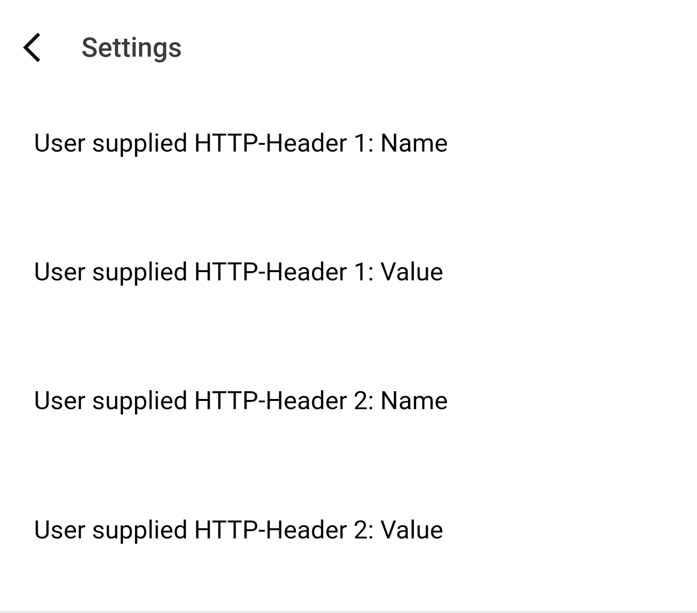

[Home](README.md) | [Switches](examples/Switches.md) | [Actions](examples/Actions.md) | [Templates](examples/Templates.md) | [Numeric](examples/Numeric.md) | [Glance](examples/Glance.md) | [Background Service](BackgroundService.md) | [Wi-Fi](Wi-Fi.md) | [HTTP Headers](HTTP_Headers.md) | [Trouble Shooting](TroubleShooting.md) | [Version History](HISTORY.md)

# User Specified Custom HTTP Headers

Principally for those who use HomeAssistant add-on [Cloudflared](https://github.com/brenner-tobias/addon-cloudflared) in order to provide additional security via Cloudflare's Web Application Firewall (WAF). But Garmin does not support certificates in requests. And the solution is generic enough for other use cases.

Please let us know if this solution is found to be useful for other situations.

## Setup

The settings contain two options for users to specify both the HTTP header name and the value as two free form strings.

If you don't know why you need these, leave them empty and ignore.

### Cloudflare WAF rule example

`(any(http.request.headers["your-header-name"][*] eq "your-header-key"))`

Make the key strong enough!

### Cloudflare Access

[Cloudflare Access](https://www.cloudflare.com/en-gb/sase/products/access/) is an authentication mechanism Cloudflare presents to HTTP requests before allowing access to the resources behind the requested URL. As a brief and incomplete guide, if you protect your HomeAssistant instance with their Zero Trust Suite then under _Access Controls_ you can create a _service token_. Note down the `Client-Id` and a `Client-Secret` which can be used as HTTP headers (e.g. `cf-access-client-id` and `cf-access-client-secret` respectively). Both of these HTTP headers must be presented by the GarminHomeAssistant application for API calls to reach your HomeAssistant instance hosted by Cloudflare, hence the pair of settings for HTTP Headers shown above. To secure a specific domain in Cloudflare you will need to add a _Self-hosted application_ and create a new _Access policy_ with the _Selector_ set to _Service Token_ (the newly create token name), and the _Action_ set to _Service Auth_ (not _Allow_).

Please note that the GarminHomeAssistant settings do not attempt to hide your password value with '*' characters, it should be private enough on your personal phone Connect IQ app.

## Support

**None!**

The authors of the Garmin HomeAssistant application do not use, and hence do not know, the [Cloudflared](https://github.com/brenner-tobias/addon-cloudflared) add-on. While we have enabled the HTTP headers to support using this add-on, it does mean _you support yourself_. Please do not raise issues about this functionality unless you are supplying the answers for any required changes too!

## Credits

With thanks to Lars Pöpperl ([@tispokes](https://github.com/tispokes)) for contributing to this solution.

## References

* [Using Cloudflare ZeroTrust and mTLS to securely access HomeAssistant via the internet](https://kcore.org/2024/06/28/using-cloudflare-zerotrust-and-mtls-with-home-assistant-via-the-internet/)
* [HomeAssistant Add-on: Cloudflared](https://github.com/brenner-tobias/addon-cloudflared)
