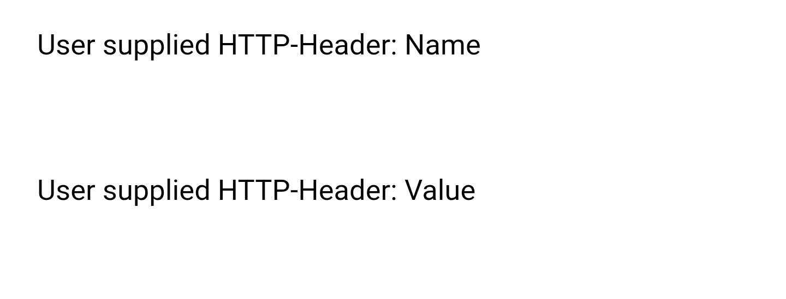

[Home](README.md) | [Switches](examples/Switches.md) | [Actions](examples/Actions.md) | [Templates](examples/Templates.md) | [Glance](examples/Glance.md) | [Background Service](BackgroundService.md) | [Wi-Fi](Wi-Fi.md) | [HTTP Headers](HTTP_Headers.md) | [Trouble Shooting](TroubleShooting.md) | [Version History](HISTORY.md)

# User Specified Custom HTTP Headers

Principally for those who use Home Assistant add-on [Cloudflared](https://github.com/brenner-tobias/addon-cloudflared) in order to provide additional security via Cloudflare's Web Application Firewall (WAF). But Garmin does not support certificates in requests. And the solution is generic enough for other use cases.

Please let us know if this solution is found to be useful for other situations.

## Setup

The settings contain two options for users to specify both the HTTP header name and the value as two free form strings.

If you don't know why you need these, leave them empty and ignore.

### Cloudflare WAF rule example

`(any(http.request.headers["your-header-name"][*] eq "your-header-key"))`

Make the key strong enough!

## Support

**None!**

The authors of the Garmin Home Assistant application do not use, and hence do not know, the [Cloudflared](https://github.com/brenner-tobias/addon-cloudflared) add-on. While we have enabled the HTTP headers to support using this add-on, it does mean _you support yourself_. Please do not raise issues about this functionality unless you are supplying the answers for any required changes too!

## Credits

With thanks to Lars Pöpperl ([@tispokes](https://github.com/tispokes)) for contributing to this solution.
