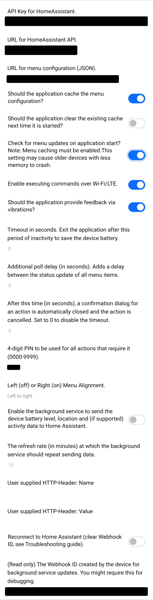

[Home](README.md) | [Switches](examples/Switches.md) | [Actions](examples/Actions.md) | [Templates](examples/Templates.md) | [Glance](examples/Glance.md) | [Background Service](BackgroundService.md) | [Wi-Fi](Wi-Fi.md) | [HTTP Headers](HTTP_Headers.md) | [Trouble Shooting](TroubleShooting.md) | [Version History](HISTORY.md)

# GarminHomeAssistant


A Garmin application to provide a "dashboard" to control your devices via [Home Assistant](https://www.home-assistant.io/). The application will never be as fully fledged as a Home Assistant dashboard, so it is designed to be good enough for the simple and essential things. Those things that can be activated via an on/off toggle or a tap. That should cover lights, switches, and anything requiring a single press such as an automation. For anything more complicated, e.g. thermostat, it would always be quicker and simpler to reach for your phone or tablet... or the device's own remote control!

The application is designed around a simple scrollable menu where menu items have been extended to interface with the [Home Assistant API](https://developers.home-assistant.io/docs/api/rest/), e.g. to get the status of switches or lights for display on the `toggle` menu item, or a text status for an entity (`info` item). It is possible to nest menus, so there is a menu item to open a sub-menu. This can be arbitrarily deep and nested in the format of a tree of items, although you need to consider if reaching for your phone becomes quicker to select the device what you want to control.

**The intended audience for this application are those comfortable with configuring a Home Assistant** (e.g. editing the YAML configuration files) and debugging why URLs don't work. It does not require programming skills, but the menu is configured via JSON which feels like "coding" (more like "describing"). If you are not comfortable with this relatively low level of configuration, you may like to try other Garmin applications instead.

**If you are struggling with getting the application to work, please consult the [troubleshooting guide](TroubleShooting.md#menu-configuration-url) first.**

## No HTTPS?

> [!IMPORTANT]
> The Garmin SDK allows HTTP requests only to a limited number of domains specified in their app. Therefore, for your Garmin to communicate with your Home Assistant instance, your Home Assistant instance must be accessible via HTTPS (with a public certificate!) or through a local DNS server that overrides one of the whitelisted domains to communicate using HTTP.
>
>New with version 3.1, you can use [Cloudflared](https://github.com/brenner-tobias/addon-cloudflared) plug-in in combination with a [custom HTTP header](HTTP_Headers.md) and do not need a public certificate for HTTPS.
>
> To make your Home Assistant instance accessible via HTTPS, you will need a public certificate. You can get one for free from [Let's Encrypt](https://letsencrypt.org/) or you can pay for [Home Assistant cloud](https://www.nabucasa.com/). (You can install a local [Nginx proxy server](https://my.home-assistant.io/redirect/supervisor_addon/?addon=a0d7b954_nginxproxymanager) to manage Let's Encrypt certificates.)
>
> If you use a local DNS server (like [Pi-Hole](https://pi-hole.net/)), you can create a local DNS record for the domain `garmincdn.com` (which is allowed for HTTP in the Garmin SDK) and map it to your Home Assistant instance's IP. "_[About Communication Between Garmin SDK and a Raspberry Pi](https://www.instructables.com/About-Communication-Between-Garmin-SDK-and-a-Raspb/)_" provides additional workarounds for HTTP request restrictions in the Garmin SDK.
>
> **No support is offered to those circumventing the HTTPS restriction of the Connect IQ SDK.** You are supporting yourself!

## Widget or Application?

As of version 2.0, there are now two installable versions. For older devices before applications supported 'glances', there is a now widget version. These two version must be downloaded separately due to the way the Connect IQ App Store requires them to have separate application IDs. Therefore you need to choose which you want up front. Here's how they compare.

| Version                | Explanation |
|------------------------|-------------|
| Application (original) | For newer devices that allow glance views in their applications, e.g. Venu 2, the GarminHomeAssistant application can be started either from a glance or from the list of applications and activities. Head over to the [GarminHomeAssistant](https://apps.garmin.com/en-US/apps/61c91d28-ec5e-438d-9f83-39e9f45b199d) application page on the [Connect IQ application store](https://apps.garmin.com/en-US/) to download the application. The application can be started two different ways, either from the glance in the carousel, or as an application from the list of applications & activities. With the latter, it is worth marking the application as a favourite.<br/><br/>If you place the application on your list of favourites, and rearrange it to appear near the top, then the item is just one button press away from the watch face. This second picture here shows the application menu on a Vivoactive 3 watch.<br/><br/>On newer watches, you can also start the application from the glance carousel. The glance view here typically displays some trackable status, so ours provides some early indication of availability. Older watches will still allow you to start this application from the list of applications and activities. |
| Widget                 | **"Maintenance only mode"** so no new features will be added to this version.<br>For older devices that use widgets, e.g. Venu (1) as opposed to applications with "glances", the GarminHomeAssistant application can instead be started from the widget carousel. This is a separate item in the Connect IQ AppStore and with this installation, the application will no longer appear in the list of applications and activities. Head over to the [GarminHomeAssistant](https://apps.garmin.com/en-US/apps/) widget page on the [Connect IQ application store](https://apps.garmin.com/en-US/) to download the widget.<br/><br/>Typically the widget view implements something similar to the glance view, e.g. status, and exists in a widget carousel to allow you to select an application to launch.<br>**Please note that memory in widgets is more limited than applications. This means a large menu definition can crash the widget without the code catching the error.**<br> This version was born out of the application version and from Ver 2.0 shared the same source code repository until Ver 2.8 when they were [separated](https://github.com/house-of-abbey/GarminHomeAssistantWidget) to allow the application version to take advantage of its increase memory availability. |

### Features

The following table lists the differences in functionality between the two. The Widget version is more limited due to memory constraints. As such new features are only being added to the Application.

| Feature | Application | Widget |
|---------|-------------|--------|
| Vibration | Optional setting | Always on |
| "Always on" support | Slow refresh option to reduce batter demand | No available |
| Metric reporting | Fuller, includes: activity, sub-activity, battery, charging, steps, heart rate, floors ascended and descended, respiration rate | Basic, includes: activity, sub-activity, battery only. |

### Source Code Repositories

* [Application](https://github.com/house-of-abbey/GarminHomeAssistant)
* [Widget](https://github.com/house-of-abbey/GarminHomeAssistantWidget)

### Connect IQ Store

* [Application](https://apps.garmin.com/en-US/apps/61c91d28-ec5e-438d-9f83-39e9f45b199d)
* [Widget](https://apps.garmin.com/en-US/apps/559f5174-177f-4f46-b170-f31c7e74dea3)

## Dashboard Definition

Setup for this menu is more complicated than the Connect IQ settings menu really allows you to specify. In order to make the dashboard easily configurable and easy to change, we have provided an external mechanism for specifying the menu layout, a JSON file you write, retrieved from a URL you specify. JSON was chosen over YAML because Garmin can parse JSON HTTP GET responses into its own internal dictionary, it cannot parse YAML, hence a choice of one really. Note that JSON and YAML are essentially a 1:1 format mapping except JSON does not have comments. We recommend you take advantage of [Home Assistant's own web server](https://www.home-assistant.io/integrations/http/#hosting-files) to provide the JSON definition. The advantages of this are:

1. the file is as public as you make your Home Assistant,
2. the file is editable within Home Assistant via "[Studio Code Server](https://my.home-assistant.io/redirect/supervisor_addon/?addon=a0d7b954_vscode)", and
3. the schema is verifiable using [JSON Schema](https://json-schema.org/overview/what-is-jsonschema).

We have used `/config/www/garmin/<something>.json` on our home brew Home Assistant's file system. That equates to a URL of `https://homeassistant.local/local/garmin/<something>.json`.

> [!IMPORTANT]
> However [recent reports](https://community.home-assistant.io/t/www-folder-location-for-local-documents/24903/16) suggest this path may no longer work on [Nabu Casa](https://www.nabucasa.com/) and you should use `/homeassistant/www/` instead of `/config/www/`. We are unable to verify this since our free trial of Nabu Casa has expired.

Schema verification is a big part of this design choice. If the application cannot read your menu definition, there's a limited amount of debug it can reasonably provide on a small screen. That responsibility now falls to you and the schema checker for help.

Example schema:

```json
{
  "$schema": "https://raw.githubusercontent.com/house-of-abbey/GarminHomeAssistant/main/config.schema.json",
  "title": "Home",
  "items": [
    {
      "entity": "script.food_on_table",
      "name": "Food is Ready!",
      "type": "tap",
      "tap_action": {
        "service": "script.turn_on",
        "confirm": true
      }
    },
    {
      "entity": "light.bedside_light_switch",
      "name": "Bedroom Light",
      "type": "toggle"
    },
    {
      "entity": "light.living_room_lights_all",
      "name": "Lounge Lights",
      "type": "toggle"
    },
    {
      "name": "Each Lounge Light",
      "title": "Lounge",
      "type": "group",
      "items": [
        {
          "entity": "light.standard_lamp",
          "name": "Standard Lamp",
          "type": "toggle"
        },
        {
          "entity": "light.bookcase_light",
          "name": "Bookcase Lamp",
          "type": "toggle"
        },
        {
          "entity": "light.corner_table_light",
          "name": "Corner Table Lamp",
          "type": "toggle"
        }
      ]
    },
    {
      "entity": "switch.bc_usbs",
      "name": "Bookcase USBs",
      "type": "toggle"
    },
    {
      "entity": "automation.garage_door_check",
      "name": "Garage Door Check",
      "type": "toggle"
    },
    {
      "entity": "automation.turn_off_usb_chargers",
      "name": "Turn off USBs",
      "type": "tap",
      "tap_action": {
        "service": "automation.trigger"
      }
    },
    {
      "entity": "scene.tv_light",
      "name": "TV Lights Scene",
      "type": "tap",
      "tap_action": {
        "service": "scene.turn_on",
        "pin": true
      }
    }
  ]
}
```

NB. Entity names are not real in case anyone's a hacker ;-).

The example above illustrates how to configure:

* Lights or switches (`toggle`), 
* Enables for automations (`toggle`), 
* Script invocation (`tap`)
* Service invocation, e.g. Scene setting, (`tap`)
* A sub-menu to open (`group`)
* You can also display the status of devices (`info`) which is essentially a `tap` with no action
* All menu items can display the results of evaluating [templates](examples/Templates.md).

The following table indicates how Home Assistant entity types can map to the Garmin applications menu types. Presently, an automation is the only one that can be either a `tap` or a `toggle`.

| HA Entity Type   | Tap | Toggle | Info (status)|
|------------------|:---:|:------:|:------------:|
| Switch           | ❌ |   ✅  |      ✅      |
| Light            | ❌ |   ✅  |      ✅      |
| Automation       | ✅ |   ✅  |      ❌      |
| Script           | ✅ |   ❌  |      ❌      |
| Scene            | ✅ |   ❌  |      ❌      |
| Sensor           | ❌ |   ❌  |      ✅      |
| Binary Sensor    | ❌ |   ❌  |      ✅      |
| Any other entity | ❌ |   ❌  |      ✅      |
| Any service      | ✅ |   ❌  |      ❌      |

Multiple templates are evaluated in a single HTTP request to update their status. Only the toggle items have the on/off  icon. NB. All `tap` items must specify a `service` tag in the `tap_action` object (see example below).

You can now specify alternative texts to use instead of "On" and "Off", e.g. "Locked" and "Unlocked" or "Open" and "Closed" through the use of a [template menu item](examples/Templates.md). But wouldn't having locks operated from your watch be a security concern ;-) ?

The [schema](https://raw.githubusercontent.com/house-of-abbey/GarminHomeAssistant/main/config.schema.json) is checked by using a URL directly back to this GitHub source repository, so you do not need to install that file. You can just copy & paste your entity names from the YAML configuration files used to configure Home Assistant. With a submenu, there's a difference between `title` and `name`. The `name` goes on the menu item, and the `title` at the head of the submenu. If your dashboard definition fails to meet the schema, the application will simply drop items with the wrong field names without warning to protect itself.

### Old deprecated format

Version 1.5 brought in a change to the JSON schema so the following old format remains useable but is no longer favoured. The schema now marks it as 'deprecated' to nudge people over.

```json
    {
      "entity": "scene.tv_light",
      "name": "TV Lights Scene",
      "type": "tap",
      "service": "scene.turn_on"
    }
```

The above should be replaced by the following:

```json
    {
      "entity": "scene.tv_light",
      "name": "TV Lights Scene",
      "type": "tap",
      "tap_action": {
        "service": "scene.turn_on"
      }
    }
```

This allows the `confirm` and `pin` fields to be accommodated in the `tap_action` along side the `service` tag, and follows the Home Assistant YAML format more closely.

### More Examples

* [Switches](examples/Switches.md)
* [Actions](examples/Actions.md)
* [Templates](examples/Templates.md)

## Editing the JSON file

You have options. The first is what we use.
1. **Best!**  Use the GarminHomeAssistant [Web-based Editor](https://house-of-abbey.github.io/GarminHomeAssistant/web/) which includes `entity` and `service` name completion and validation by fetching data from your own Home Assistant instance. _Pretty  nifty eh?_ The other method listed below do not add this convenience and checking.
2. Use the [Studio Code Server](https://community.home-assistant.io/t/home-assistant-community-add-on-visual-studio-code/107863) addon for Home Assistant. You can then edit your JSON file in place.
3. Locally installed VSCode, or if not installed, try
4. The on-line version at https://vscode.dev/, which works really well.

Paste in your JSON (and change the file type to JSON if not saving), it will then verify your file format and schema for you, highlighting any errors for you to fix.

A failure to get the file format right tends to mean that the response to the application errors with `INVALID_HTTP_BODY_IN_NETWORK_RESPONSE` (code of -400). This means the response did not contain JSON, it was probably an error message in plain text that could not be parsed by the Connect IQ API call. See [Toybox.Communications](https://developer.garmin.com/connect-iq/api-docs/Toybox/Communications.html) for the list of error code you might be presented with on your device.

There are some cases where the file format may be valid JSON, but invalid against the schema, and the failure to catch this error could cause the application to crash. Whilst we have taken care to manage many issues, there may still be cases that are uncaught.

Make sure you can browse to the URL of your JSON file in a standard web browser to make sure it is accessible.

## API Key Creation

Having created your JSON definition for your dashboard, you need to create an API key for your personal account on Home Assistant. You will need a [Long-Lived Access Token](https://developers.home-assistant.io/docs/auth_api/#long-lived-access-token). This is not obvious to find and is bound to your own Home Assistant account. Follow the menu sequence: `HA -> User Profile -> "Security" tab -> Long-lived access tokens`. Make sure you save the generated token before dismissing it.


Having created that token, before you dismiss the dialogue box with the value you will never see again, copy it somewhere safe. You need to paste this into the Garmin Application's settings. You may like to perform this task on your phone so that you can copy and paste it (and message yourself a copy too ;-)).

## API URL

If you are using [Nabu Casa](https://www.nabucasa.com/) then your Cloud API URL can be found by looking up your URL via `HA -> Settings -> Home Assistant Cloud -> Remote Control -> Nabu Casa URL` and don't forget to add `/api` to the end of the copied string.


If you have built your own infrastructure, you really don't need any assistance with the API URL!

## Settings

Unfortunately the Settings dialogue box in the Garmin IQ application "times out" in Android when you go to a different screen (a browser for example). When you go back to the Connect IQ application (select the view again) the settings dialogue box is broken and you have to open the Settings again, so you will need to save the settings every time before you switch applications to avoid losing the information you just put in. We recommend you can use an application like [Microsoft's "Phone Link"](https://apps.microsoft.com/detail/9NMPJ99VJBWV?hl=en-gb&gl=US) that allows you to *copy and paste* between your PC and your phone.

**Please, please, please!** *Copy and paste* your API key and all URLs, do not retype them as they will be wrong.



1. Copy and paste your API key you've just created into the top field.
2. Add the URL for your Home Assistant API, e.g. `https://<homeassistant>/api`. (No trailing slash `/`` character as one gets appended when creating the URL and you do not want two.)
3. Add the URL of your JSON file, e.g. `https://<homeassistant>/local/garmin/<something>.json`.

You should now have a working application on your watch and be able to operate your Home Assistant devices for as long as your watch is within Bluetooth range of your phone.

You may choose to cache your menu definition on your device in order to reduce the delay in showing the menu (as it saves waiting for an HTTP GET request). If you use this option you need to be aware of how updates to the menu are managed. You may either:

1. **Choose to have the cache cleared.** The toggle option below the cache option allows you to choose to refresh the cache the next time the application starts. Once the cache has been cleared, the application will reset this toggle for you, so you do not need to return to the settings to amend it.
2. **Let the application retrieve the menu after starting and setting up the switch states** (including evaluating [templates](examples/Templates.md)), and then verify you have the latest menu. If a newer menu is retrieved you will be notified via a 'toast' or blue screen for devices without a toast in their API. You will be prompted to restart the application in order to build the menu from this latest menu definition. There are no plans to make the menu definition update recreate the rendered menu items because it could change the selected item just as you action it, and because restarting is simple for the user and simpler for the code. **This method has proven tricky in older devices with less memory.** Hence it can be turned off to avoid "Out of Memory" crashes. The application tries to protect against crashes by detecting insufficient memory and disabling the option (but note that this may require some tuning). Hence this option is off by default in case it causes a crash and new users are unaware of the potential cause.

The application uses vibration to confirm the action has been requested, which is different to the 'toast' that appears to show the action has been successfully executed. This is enabled by default but may be turned off if you do not desire this behaviour.

The application timeout prevents the HomeAssistant App running on your watch when you have forgotten to close it. It prevents the refreshing of the menu statuses and therefore excessive wear on your battery level. For those users who prefer to keep the application open all the time for continuous use, they can reduce the battery wear by increasing the "poll delay". This inserts a user configurable number of seconds between each round of item update checks, hence reducing the API access activity. This also reduces the responsive of the statuses displayed when HA devices are switched externally, i.e. by another Home Assistant client, then the watch menu display will not update as quickly. Therefore if you only use the HomeAssistant App briefly now and then, keep this setting at the default 0 seconds. NB. To be clear, all items are updated then a configurable delay is inserted before the next round of all item updates. If your poll delay is greater than zero, then your application timeout should be set to zero, otherwise you will exit the application and negate the value of the poll delay function.

| Application Timeout | Poll Delay | Comment |
|:-------------------:|:----------:|:--------|
|          0          |     0      | Permanently open, poll as fast as possible. This is the simple default, but could drain your battery |
|         > 0         |     0      | Temporarily open, poll as fast as possible, responsive and limits battery drain by closing. |
|          0          |    > 0     | Permanently open, but poll more gently to save battery. |
|         > 0         |    > 0     | Temporarily open, poll more gently to save battery, but the application closes before the benefit is realised. Not recommended. |

There is a second timeout value for confirmation views. This is intended for use with more sensitive toggles so that the confirmation view is not left open and forgotten and then confirmed accidentally without you noticing. **We cannot advise you this is safe, be careful what you toggle with the watch application!** _The developers will not be held responsible for any insecurities resulting from using this feature, including any inadvertent code changes that cause the PIN feature to not work._

The confirmation timeout is also used for the maximum time between clicks in the PIN confirmation dialog. The PIN confirmation provides a more secure alternative for toggling security-sensitive actions.

There is a toggle setting for "text alignment" that provides finer adjustment for right-to-left languages. Perhaps this could be made automatic based on device language?

The application and widget both include a background service to report your watch's battery level and charging status. You may enable a background service to report the battery level to your Home Assistant. This is not available over your Bluetooth connection like with other Bluetooth devices as Garmin did not implement it. This no longer requires any setup, and we offer this [trouble shooting](TroubleShooting.md#watch-battery-level-reporting) guide. The last field here is readonly and allows the user to copy & paste the Webhook ID setup by the application when required for this trouble shooting guide.

## Tap Item Response

Its obvious that a toggle menu item has been triggered as the visible switch changes position and colour. Less obvious is that you have successfully triggered a tap operation.


The application will display a 'toast' showing Home Assistant's friendly name of the triggered item. The toast will disappear after a short while if not dismissed by the user. N.B. There are reports that on the Forerunner 55 device, the toasts do not dissapear without manual intervention. On other devices like the Venu 2 the toast can take 15 seconds to dissappear if not dismissed. Unfortunately, there is no API call to change this behaviour.

## External Device Changes

Home Assistant will inevitably change the state of devices you are also controlling via your Garmin. The Garmin application does not maintain a web socket to listen for changes. Instead it must poll the Home Assistant API with your key. Therefore the application is not that responsive to changes. Instead there will be a delay of multiples of 100 ms per item whose status needs to be checked and amended.

The per toggle item delay is caused by a queue of responses to web requests. The responses fill up a buffer and in early testing we observed [`Communications.BLE_QUEUE_FULL`](https://developer.garmin.com/connect-iq/api-docs/Toybox/Communications.html) response codes.  For a Venu 2 Garmin watch an API call delay of 600 ms was found to be sustainable (500 ms was still too fast). The code now chains a sequence of updates, so as one finishes it invokes the next item's update. **The more items requiring a status update that you pack into your dashboard, the slower each individual item will be updated!**

The thinking here is that the watch application will only ever be open briefly not persistently, so the delay in picking up state changes won't be observed often for any race condition between two controllers. As a consequence of this update mechanism, if you request changes too quickly you will be notified that your device cannot keep up with the rate of API responses and you will have to dismiss the error in order to continue. This is a _feature not a bug_! If the application reduces the rate of "round robin" status update requests it becomes less responsive to external changes.

To prevent excessive battery usage, set the application timeout in the settings. This will prevent you from leaving the application open and forgotten when not being used, and the polling mechanism will then cease, saving battery life. Again, the thinking here is that the watch application will only ever be open briefly not persistently, and hence not be a constant source of battery usage unless the [background service](BackgroundService.md) for sending any watch status is used aggressively fast.

## Changes to the (JSON) Dashboard Definition

When you change the JSON file defining your dashboard, you must exit the application and the reopen it. It only takes a matter of a few seconds to pick up the new definition, but it is not automatic. *Don't forget* you may explicitly choose to clear your cached menu, or wait the application to discover your definition has changed and prompt you to restart. The application check only happens once after startup, rendering menu items and setting the menu item states.

## Submitting Corrections for Translations

Initially all text has been created in English, and a [Python script](https://github.com/house-of-abbey/GarminHomeAssistant/blob/main/translate.py) (Google Translate under the hood) has been used to create the first version of all translations. We have been pleased to accept better translations from native language speakers, *thank you*. If you would like to submit improved translations, our preference is you do so via a [Git pull request](https://github.com/house-of-abbey/GarminHomeAssistant/pulls). If you are not comfortable doing this, then just raise an issue and someone will eventually pick the request up.

In order to submit a language correction please create an XML file called `corrections.xml` in the same directory as your language containing the corrected text. The format of the XML file follows that of `strings.xml`. As an example here are some corrected French translations found in directory [`resources-fre/strings/corrections.xml`](https://github.com/house-of-abbey/GarminHomeAssistant/tree/main/resources-fre/strings/corrections.xml):

```xml
<strings>
  <string id="MenuItemOn">Activé</string>
  <string id="MenuItemTap">Clic</string>
  <string id="ApiFlood">Appels API trop rapide. Veuillez signaler cette erreur avec les détails de l'appareil.</string>
</strings>
```

The `id` attribute values are taken from the same names used in [`strings.xml`](https://github.com/house-of-abbey/GarminHomeAssistant/blob/main/resources-fre/strings/strings.xml). **Not all `id` values need to be specified as missing `id`s will then use automatic translations.** If the existing convention is followed then:

* The Python script will use the corrections in preference to translating, and
* Your pull request will be honoured without comment as we will take your corrections on trust.

## Known Issues

Check the latest unresolved [issues](https://github.com/house-of-abbey/GarminHomeAssistant/issues) on Github. Otherwise the following are persistent issues with no realistic resolution.

1. There are some cases where the file format may be valid JSON, but invalid against the schema, and the failure to catch this error could cause the application to crash. Whilst we have taken care to manage many issues, there may still be cases that are uncaught. Please verify your JSON schema, see the [trouble shooting guide](TroubleShooting.md).

2. On some (old) devices (e.g. Vivoactive 3, Fenix 5s & Edge 520+), the menu does not update correctly to reflect changes in state effected by an external Home Assistant control. E.g. when the phone application changes the toggle status of a switch, the Garmin application does not reflect that change until the menu is touched or scrolled a little. This is a [known issue](https://forums.garmin.com/developer/connect-iq/i/bug-reports/menu2-doesn-t-allow-live-updates) already reported without a suggested software fix.

3. The iPhone Connect IQ application has a bug in it we cannot be responsible for. Thanks to user [a_smart_hoome](https://community.home-assistant.io/u/a_smart_hoome) who worked the problem with the dropped Internet connection, see his explanation at https://community.home-assistant.io/t/home-assistant-app-for-garmin/637348/61 for details. Please complain to the Connect IQ application developers rather than us!

4. Templates can require significant definition for highly customised text. Just remember, you have the ability to crash the application by creating an excessively long menu definition. Don't be silly.

5. Parameters to tap menu items cannot have their parameter usage verified. If you get this wrong and crash the application, that's your fault not the application's. In this case, start by removing the parameters for the menu item causing the crash, and add them back one at a time until you find your fault. **Please don't give the application a poor review for your bad parameter definition!**

6. We are unable to support Edge 540, Edge 840 and Edge 1050 devices at this time. The simulation of these devices has two unexpected errors when toggling or executing taps. We get both `Communications.NETWORK_RESPONSE_OUT_OF_MEMORY` and `Communications.BLE_QUEUE_FULL` even though the memory usage is about 6% of the available RAM. Based on a lead from user @Petucky, both devices are being re-enabled as testing on a real Edge 840 device has proven successful, however we remain unable to support either devices until the simulator is fixed.

7. We are unable to support HTTP natively (without the workaround specified earlier). This is a limitation placed upon us by the Connect IQ API which for security reasons refuses to work with HTTP requests. There is nothing developers can do about this limitation. See the [Trouble Shooting](TroubleShooting.md#do-it-yourself-setup) guide for an example setup. We would appreciate it if users did not leave poor reviews for the lack of this feature which is beyond our control to fix.

8. There is a [bug in Garmin Express so that when you use that software to amend the application's settings](https://github.com/house-of-abbey/GarminHomeAssistant/issues/194), the page appears in a random language not of your choice. I would like to thank user [heviiguy](https://github.com/heviiguy) for his work researching the issue, leading to these references that indicate the authors of Garmin Home Assistant cannot resolve this issue as its a bug in Garmin Express that Garmin are refusing to believe exists! See these pages for details:
   - [Garmin Express - Wrong Language](https://forums.garmin.com/developer/connect-iq/i/bug-reports/garmin-express---wrong-language)
   - [Incorrect language displayed for custom data fields](https://forums.garmin.com/developer/connect-iq/f/discussion/388137/incorrect-language-displayed-for-custom-data-fields)

9. When using Wi-Fi or LTE to toggle a light, the `toggle` will fail when the default or current state of the application's menu does not match the state of the light. The same applies to a cover or other thing that can be toggled. This is because the application is unable to initialise the menu with the current state without Bluetooth. Hence the Wi-Fi/LTE functionality is best used with `tap` items only.

# Authors & Contributors

For an up to date list of all authors and contributors, please check the [contributor's page](https://github.com/house-of-abbey/GarminHomeAssistant/graphs/contributors). Thank you all for improving this application.
