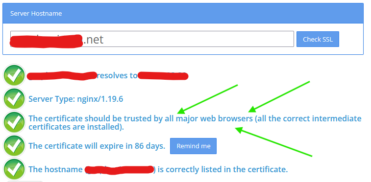

[Home](README.md) | [Switches](examples/Switches.md) | [Actions](examples/Actions.md) | [Templates](examples/Templates.md) | [Glance](examples/Glance.md) | [Background Service](BackgroundService.md) | [Wi-Fi](Wi-Fi.md) | [HTTP Headers](HTTP_Headers.md) | [Trouble Shooting](TroubleShooting.md) | [Version History](HISTORY.md)

# Troubleshooting Guides

## Check your JSON Schema

Before [raising an issue](https://github.com/house-of-abbey/GarminHomeAssistant/issues) about a possible bug, _please, please_ check your JSON is compliant with both the JSON format and our schema. To do this you have options. The first is what we use.

1. **Best!**  Use the GarminHomeAssistant [Web-based Editor](https://house-of-abbey.github.io/GarminHomeAssistant/web/) which includes `entity` and `service` name completion and validation by fetching data from your own Home Assistant instance. _Pretty  nifty eh?_ The other methods listed below do not add this convenience and checking.
2. Use the [Studio Code Server](https://community.home-assistant.io/t/home-assistant-community-add-on-visual-studio-code/107863) addon for Home Assistant. You can then edit your JSON file in place.
3. Locally installed VSCode, or if not installed, try
4. The on-line version at https://vscode.dev/, which works really well. Paste in your JSON (and change the file type to JSON if not saving), it will then verify your file format and schema for you, highlighting any errors for you to fix.

A failure to get the file format right tends to mean that the response to the application errors with `INVALID_HTTP_BODY_IN_NETWORK_RESPONSE` (code of -400). This means the response did not contain JSON, it was probably an error message in plain text that could not be parsed by the Connect IQ API call. See [Toybox.Communications](https://developer.garmin.com/connect-iq/api-docs/Toybox/Communications.html) for the list of error code you might be presented with on your device.

There are some cases where the file format may be valid JSON, but invalid against the schema, and the failure to catch this error could cause the application to crash. Whilst we have taken care to manage many issues, there may still be cases that are uncaught.

Make sure you can browse to the URL of your JSON file in a standard web browser to make sure it is accessible.

## Watch Menu and API

With either of the following setups, there are inevitably some problems along the way. GarminHomeAssistant is careful to rely only on having working URLs. Getting them working is the user's responsibility. However, we have developed some fault finding tools.

### Nabu Casa Setup

You can purchase cloud-based access to your Home Assistant from [Nabu Casa](https://www.nabucasa.com/), and then your setup will look something like this.


- Your API URL would be of the format `https://<id>.ui.nabu.casa/api`
- Your Garmin Watch Menu would be of the format Menu: `https://<id>.ui.nabu.casa/local/garmin/menu.json`

Where `<id>` is your personal Nabu Casa account ID.

### Do It Yourself Setup

Before Nabu Casa, or if you wanted to manage your own infrastructure, you might have something like the following:


Now you have to manage:

- Dynamic DNS
- Public access via router port forwarding
- Security via HTTPS and URL forwarding
- Certificates for HTTPS via say [Let's Encrypt](https://letsencrypt.org/) (an Nginx proxy web server helps here)
- Proxy allow list in `configuration.yaml` as follows:

```yaml
http:
  use_x_forwarded_for: true
  trusted_proxies:
    - 127.0.0.1
    - 192.168.xx.xx  # Server IP - AMEND THIS
    - 172.30.32.0/23 # Docker IPs for NGINX
    - 172.30.33.0/24 # SSL proxy server
    - 172.16.0.0/12  #
```

### Menu Configuration URL

This URL is very simple, you should be able to read the contents returned in a standard web browser.


(Other browsers are available...)

The browser page should then display the JSON string you saved to the file on the web server. The point is this is a simple HTTP GET request with no bells and whistles.

The menu configuration can be hosted anywhere, it does not have to be on the Home Assistant web server. Just as long as it is reachable from your phone from which you Bluetooth connect to your watch, or you watch if it has direct Internet access.

### Home Assistant API URL

This is slightly trickier owning to the need to supply the API key. Here are three ways you can test your API URL is correctly configured. If successful, each of these should produce a JSON string output looking like:

```json
{ "message": "API running." }
```

#### API: Linux, MacOS, UNIX, Cygwin etc

Save the following as a file called `api_test.sh`, edit to include your personal values for the variables, `chmod +x api_test.sh` and then execute with `./api_test.sh`.

```shell
#!/bin/bash

API_KEY="<Your API key>"
URL="https://<Your Domain>/api"

curl -s -X GET \
  -H "Authorization: Bearer ${API_KEY}" \
  -H "Content-Type: application/json" \
  ${URL}/
```

#### API: MS Windows

Save the following as a file called `api_test.cmd`, edit to include your personal values for the variables and then double click.

```cmd
@echo off

set API_KEY=<Your API key>
set URL=https://<Your Domain>/api

curl -s -X GET ^
  -H "Authorization: Bearer %API_KEY%" ^
  -H "Content-Type: application/json" ^
  %URL%/

echo.
pause
```


#### API: On-line

There's an online way of testing the API URL too, thanks to [REQBIN](https://reqbin.com/post-online). This has less setup and it can be saved if you log into the web site.


#### SSL Certificate Chain

With thanks to [@ziceva](https://github.com/ziceva) for solving this problem. The symptoms are:
1. Using an API URL with SSL (HTTPS), the [web-based editor](https://house-of-abbey.github.io/GarminHomeAssistant/web/) running in a browser on the same phone running Garmin Connect works well.
2. The exact same configuration is set in the Garmin Home Assistant application.
3. The Garmin Home Assistant application reports:
```
API: not available
Menu: not available
```

**Solution: Make sure you use a _full chain_ certificate in your HTTPS proxy as some watches might be unable to validate the site certificate alone.**

Most web browsers and OSes probably have the latest Certificate Authorities (CAs) trusted out-of-the-box and so they do not need the full chain to verify the certificates. Garmin watches may not have the latest CAs and that is why the Troubleshooting web page does not catch this problem. E.g. It turns out some Garmin watches do not have the LetsEncrypt CA marked as trusted.

To verify if you have this issue you can use a tool like [SSL Shoppers's SSL Checker](https://www.sslshopper.com/ssl-checker.html), which will catch this issue. The following two screen captures illustrate the difference between partial and full chain certificates respectively.

##### Partial Chain Certificate


##### Full Chain Certificate




### Top Problems

1. Failure to copy & paste keys and URLs leading to minor and hard to see errors in strings, even with protestations they are the same! (No they weren't...)
2. Accessibility of URLs, hence the above help guide.

## Watch Battery Level Reporting

For this you will need to have already got the main application or widget working with a menu in order to prove that the API calls are successful. We have proven this works with both our home brew infrastructure as well as Nabu Casa. Now with a script similar to one of the following two, you should be able to fake the watch API call and verify receipt by Home Assistant.

#### Battery: Linux, MacOS, UNIX, Cygwin etc

Assume a file called: `send_battery.bash`

```shell
#!/bin/bash
#
#               battery% charging {0|1}
# ./send_battery.bash 19 0
#

WEBHOOK_ID="<Your Webhook ID>"
URL="https://<Your Domain>/api"

level=${1:-50}
is_charging=${2:-0}
echo "Battery Level = ${level}"
if [ ${is_charging} -eq 1 ]; then
  is_charging=true
else
  is_charging=false
fi
echo "Battery Charging? = ${is_charging}"
echo ""

curl -s -X POST \
  -H "Content-Type: application/json" \
  -d '{ "type": "update_sensor_states", "data": [ {"state": '${level}',"type": "sensor","unique_id": "battery_level"}, {"state": '${is_charging}',"type": "binary_sensor","unique_id": "battery_is_charging"} ] }' \
  ${URL}/webhook/${WEBHOOK_ID}
```

Execute:

```
$ ./send_battery.bash 45 1
```

The output looks like this:

```
Battery Level = 45
Battery Charging? = true

{
  "battery_level": {
    "success": true
  },
  "battery_is_charging": {
    "success": true
  }
}

```

NB. The device ID can be any string for the purposes of this testing. Your Garmin device will choose this ID for you when it submits the readings.

#### Battery: MS Windows

Assume a file called: `home_assistant_battery_level.cmd`

```cmd
@echo off
rem               battery% charging {0|1}
rem ./home_assistant_battery_level 19 0
rem

set WEBHOOK_ID=<Your Webhook ID>
set URL=https://<Your Domain>/api

if [%1] == [] (
  set level=50
) else (
  set level=%1
)

if [%1] == [] (
  set is_charging=0
) else (
  set is_charging=%2
)
echo "Battery Level = %level%"
if "%is_charging%"=="1" (
  set is_charging=true
) else (
  set is_charging=false
)
echo "Battery Charging? = %is_charging%"
echo.

curl -s -X POST ^
  -H "Content-Type: application/json" ^
  -d "{ \"type\": \"update_sensor_states\", \"data\": [ {\"state\": %level%,\"type\": \"sensor\",\"unique_id\": \"battery_level\"}, {\"state\": %is_charging%,\"type\": \"binary_sensor\",\"unique_id\": \"battery_is_charging\"} ] }" ^
  %URL%/webhook/%WEBHOOK_ID%

echo.
pause
```

Execute:

```
> home_assistant_battery_level.cmd 41 1
```

The output looks like this:

```
"Battery Level = 41"
"Battery Charging? = true"

{
  "battery_level": {
    "success": true
  },
  "battery_is_charging": {
    "success": true
  }
}

Press any key to continue . . .
```

NB. The device ID can be any string for the purposes of this testing. Your Garmin device will choose this ID for you when it submits the readings.

#### Battery: On-line

There's an online way of testing the API URL too, thanks to [REQBIN](https://reqbin.com/post-online). This has less setup and it can be saved if you log into the web site.

URL for copy & paste:

```
https://<Your Domain>/api/webhook/<Your Webhook ID>
```


JSON for copy & paste:

```json
{
  "type": "update_sensor_states",
  "data": [
    {
      "state": 40,
      "type": "sensor",
      "unique_id": "battery_level"
    },
    {
      "state": true,
      "type": "binary_sensor",
      "unique_id": "battery_is_charging"
    }
  ]
}
```

# Failed API Calls


When the application persists in reporting "No JSON returned from HTTP request." this might be due to a mismatch between the Webhook ID and the device settings on the Home Assistant server. The application options include the ability to clear the Webhook ID in the application forcing a new one to be set up.

# Debug Logs

As a desperate measure to assist with debugging the Home Assistant Application, you might be asked to send the authors a debug log.


The figure above shows how to find the file on Windows by attaching your watch by USB cable. Inside the `CIQ_LOG.YML` file there are often multiple entries, each looking like this:

```
Error: Unexpected Type Error
Details: 'Failed invoking <symbol>'
Time: 2024-08-30T12:00:25Z
Part-Number: 006-B3703-00
Firmware-Version: '19.05'
Language-Code: eng
ConnectIQ-Version: 4.2.4
Store-Id: 61c91d28-ec5e-438d-9f83-39e9f45b199d
Store-Version: 30
Filename: DCRL0437
Appname: HomeAssistant
Stack: 
  - pc: 0x10003b5e
```

The only useful information we can glean from this log is the first line, `Error: Unexpected Type Error`. There is no useful mapping to a line of code unless someone can explain to us how to use the `pc` line. Being able to send us the error type does serve as a clue.

More on [debugging Monkey C applications](https://developer.garmin.com/connect-iq/core-topics/debugging/#appcrashes). The filenames and line numbers must only be present for deployment of code instrumented for debug.
