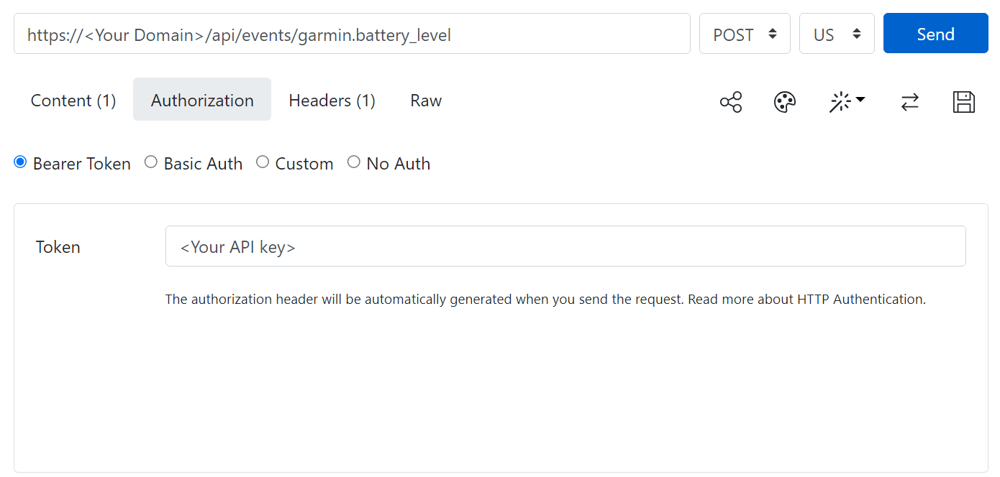
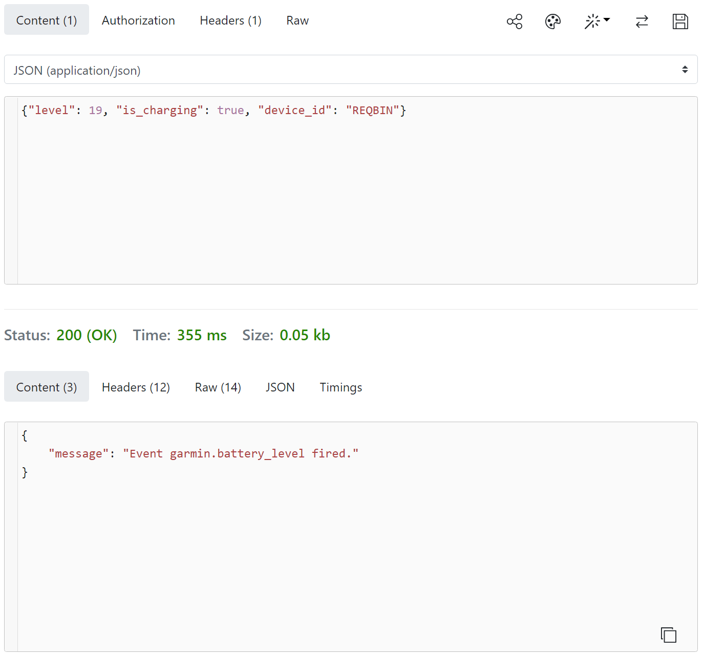

# Troubleshooting Guides

## Watch Menu and API

With either of the following setups, there are inevitably some problems along the way. GarminHomeAssistant is careful to rely only on having working URLs. Getting them working is the user's responsibility. However, we have developed some fault finding tools.

### Nabu Casa Setup

You can purchase cloud-based access to your Home Assistant from [Nabu Casa](https://www.nabucasa.com/), and then your setup will look something like this.


* Your API URL would be of the format `https://<id>.ui.nabu.casa/api`
* Your Garmin Watch Menu would be of the format Menu: `https://<id>.ui.nabu.casa/local/garmin/menu.json`

Where `<id>` is your personal Nabu Casa account ID.

### Do It Yourself Setup

Before Nabu Casa, or if you wanted to manage your own infrastructure, you might have something like the following:


Now you have to manage:

* Dynamic DNS
* Public access via router port forwarding
* Security via HTTPS and URL forwarding
* Certificates for HTTPS via say [Let's Encrypt](https://letsencrypt.org/) (Nginx web server helps here)
* Proxy allow list in `configuration.yaml` as follows:

```yaml
http:
  use_x_forwarded_for: true
  trusted_proxies:
    - 127.0.0.1
    - 192.168.xx.xx  # Server IP - AMEND THIS
    - 172.30.32.0/23 # Docker IPs for NGINX
    - 172.30.33.0/24 # SSL proxy server
    - 172.16.0.0/12  #
```

### Menu Configuration URL

This URL is very simple, you should be able to read the contents returned in a standard web browser.


(Other browsers are available...)

The browser page should then display the JSON string you saved to the file on the web server. The point is this is a simple HTTP GET request with no bells and whistles.

The menu configuration can be hosted anywhere, it does not have to be on the Home Assistant web server. Just as long as it is reachable from your phone from which you Bluetooth connect to your watch, or you watch if it has direct Internet access.

### Home Assistant API URL

This is slightly trickier owning to the need to supply the API key. Here are three ways you can test your API URL is correctly configured. If successful, each of these should produce a JSON string output looking like:

```json
{"message":"API running."}
```

#### API: Linux, MacOS, UNIX, Cygwin etc

Save the following as a file called `api_test.sh`, edit to include your personal values for the variables, `chmod +x api_test.sh` and then execute with `./api_test.sh`.

```shell
#!/bin/bash

API_KEY="<Your API key>"
URL="https://<Your Domain>/api"

curl -s -X GET \
  -H "Authorization: Bearer ${API_KEY}" \
  -H "Content-Type: application/json" \
  ${URL}/
```

#### API: MS Windows

Save the following as a file called `api_test.cmd`, edit to include your personal values for the variables and then double click.

```cmd
@echo off

set API_KEY=<Your API key>
set URL=https://<Your Domain>/api

curl -s -X GET ^
  -H "Authorization: Bearer %API_KEY%" ^
  -H "Content-Type: application/json" ^
  %URL%/

echo.
pause
```


#### API: On-line

There's an online way of testing the API URL too, thanks to [REQBIN](https://reqbin.com/post-online). This has less setup and it can be saved if you log into the web site.


### Top Problems

1. Failure to copy & paste keys and URLs leading to minor and hard to see errors in strings, even with protestations they are the same! (No they weren't...)
2. Accessibility of URLs, hence the above help guide.

## Watch Battery Level Reporting

For this you will need to have already got the main application or widget working with a menu in order to prove that the API calls are successful. We have proven this works with both our home brew infrastructure as well as Nabu Casa. Now with a script similar to one of the following two, you should be able to fake the watch API call and verify receipt by Home Assistant in the Event logging by clicking the following button.

[](https://my.home-assistant.io/redirect/developer_events/)

#### Battery: Linux, MacOS, UNIX, Cygwin etc

Assume a file called: `send_battery.bash`

```shell
#!/bin/bash
#
#               battery% charging {0|1}
# ./send_battery.bash 19 0
#

API_KEY="<Your API key>"
URL="https://<Your Domain>/api"

level=${1:-50}
is_charging=${2:-0}
echo "Battery Level = ${level}"
if [ ${is_charging} -eq 1 ]; then
  is_charging=true
else
  is_charging=false
fi
echo "Battery Charging? = ${is_charging}"
echo ""

curl -s -X POST \
  -H "Authorization: Bearer ${API_KEY}" \
  -H "Content-Type: application/json" \
  -d '{"level": '${level}', "is_charging": '${is_charging}', "device_id": "Bash Script"}' \
  ${URL}/events/garmin.battery_level
```

Execute:

```
$ ./send_battery.bash 45 1
```

The output looks like this:

```
Battery Level = 45
Battery Charging? = true

{"message":"Event garmin.battery_level fired."}
```

NB. The device ID can be any string for the purposes of this testing. Your Garmin device will choose this ID for you when it submits the readings.

#### Battery: MS Windows

Assume a file called: `home_assistant_battery_level.cmd`

```cmd
@echo off
rem               battery% charging {0|1}
rem ./home_assistant_battery_level 19 0
rem

set API_KEY=<Your API key>FEt_fGzW_lV0xitvJPkaQHSLhGm90ADovgMbJxdHH2I
set URL=https://<Your Domain>/api

if [%1] == [] (
  set level=50
) else (
  set level=%1
)

if [%1] == [] (
  set is_charging=0
) else (
  set is_charging=%2
)
echo "Battery Level = %level%"
if "%is_charging%"=="1" (
  set is_charging=true
) else (
  set is_charging=false
)
echo "Battery Charging? = %is_charging%"
echo.

curl -s -X POST ^
  -H "Authorization: Bearer %API_KEY%" ^
  -H "Content-Type: application/json" ^
  -d "{\"level\": %level%, \"is_charging\": %is_charging%, \"device_id\": \"Batch File\"}" ^
  %URL%/events/garmin.battery_level

echo.
pause
```

Execute:

```
> home_assistant_battery_level.cmd 41 1
```

The output looks like this:

```
"Battery Level = 41"
"Battery Charging? = true"

{"message":"Event garmin.battery_level fired."}
Press any key to continue . . .
```

NB. The device ID can be any string for the purposes of this testing. Your Garmin device will choose this ID for you when it submits the readings.

#### Battery: On-line

There's an online way of testing the API URL too, thanks to [REQBIN](https://reqbin.com/post-online). This has less setup and it can be saved if you log into the web site.

URL for copy & paste:

```
https://<Your Domain>/api/events/garmin.battery_level
```



JSON for copy & paste:

```json
{"level": 19, "is_charging": true, "device_id": "REQBIN"}
```


