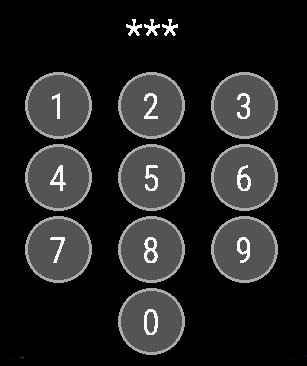

[Home](../README.md) | [Switches](Switches.md) | [Actions](Actions.md) | [Templates](Templates.md) | [Glance](Glance.md) | [Background Service](../BackgroundService.md) | [Wi-Fi](../Wi-Fi.md) | [HTTP Headers](../HTTP_Headers.md) | [Trouble Shooting](../TroubleShooting.md) | [Version History](../HISTORY.md)


# Actions

A simple example using a scene as a `tap` menu item.

```json
{
  "entity": "scene.telly_watching",
  "name": "Telly Scene",
  "type": "tap",
  "tap_action": {
    "service": "scene.turn_on"
  }
},
```

Any menu item with an action (`tap`, `template`, or `toggle`), may have a confirmation view added. For consistency this is always done via the `tap_action` JSON object, even though for a `toggle` menu item there will only ever be a single field inside. For the `toggle` menu item, the confirmation is presented on both `on` and `off` directions. There is no option for asymmetry, i.e. only in one direction.

```json
  "tap_action": {
    "confirm": true
  }
```


For example:

```json
{
  "entity": "switch.garage_door",
  "name": "Garage Door",
  "type": "toggle",
  "tap_action": {
    "confirm": true
  }
}
```

**The authors do not advise the use of this application for security sensitive devices. But we suspect users are taking that risk anyway, hence a PIN confirmation is provided that can be used for additional menu item security.**

This can be enabled by setting the `pin` field in the `tap_action`. The `pin` field overrides `confirm`. Explicitly setting `confirm` is not necessary.

The 4-digit PIN is set globally for all actions in the app settings in Connect IQ.

```json
  "tap_action": {
    "pin": true
  }
```

When entering an invalid PIN for the fifth time within 2 minutes, the PIN dialog will be locked for all actions for the next 10 minutes. Entering a valid PIN will always reset the failure counter.



Note that for notify events, you _must_ not supply an `entity_id` or the API call will fail. There are other examples too.

```json
{
  "name": "Message",
  "type": "tap",
  "tap_action": {
    "service": "notify.mobile_app_on_phone",
    "data": {
      "title": "This is a title",
      "message": "This is the message"
    },
    "confirm": true
  }
}
```

> [!IMPORTANT]
> Be careful with the value of the `service` field.

Note that the `service` field will need to be a locally custom `script.<something>` as soon as any `data` fields are populated and not something more generic like `script.turn_on`. If the `service` field is wrong, the application will fail with a [`Communications.INVALID_HTTP_BODY_IN_NETWORK_RESPONSE`](https://developer.garmin.com/connect-iq/api-docs/Toybox/Communications.html) error in the response from your HomeAssistant and show the error message as _"No JSON returned from HTTP request"_ on your device. In the [web-based editor](https://house-of-abbey.github.io/GarminHomeAssistant/web/) you can use the standard developer tools to observe an `HTTP 400` error which the application does not see. Here we are limited by the [Garmin Connect IQ](https://developer.garmin.com/connect-iq/overview/) software development kit (SDK). We do not have enough information at the point of execution in the application to determine the cause of the error. Nor is there an immediately obvious way of identifying this issue using the JSON schema checks.

## Exit on Tap

You can choose individual items that will quit after they have completed their action.

```json
{
  "entity": "automation.turn_off_stuff",
  "name": "Turn off Stuff",
  "type": "tap",
  "tap_action": {
    "service": "automation.trigger"
  },
  "exit": true
}
```

## Disable Menu Item

If you would like to temporarily disable an item in your menu, e.g. for seasonal reasons like not needing to turn on the heating in summer, then rather than swapping menu definition files or deleting a section of the menu you can mark the item as 'disabled'. This field applies to all menu items.

```json
{
  "entity": "automation.turn_off_stuff",
  "name": "Turn off Stuff",
  "type": "tap",
  "tap_action": {
    "service": "automation.trigger"
  },
  "enabled": false
}
```

# Selects

Here is an example of how to make a light effect selector:

```json
{
  "type": "group",
  "name": "Example",
  "title": "Light Effect",
  "content": "{{ state_attr('light.moon', 'effect') }}",
  "items": [
    {
      "type": "tap",
      "name": "None",
      "entity": "light.example",
      "tap_action": {
        "service": "light.turn_on",
        "data": {
          "effect": "None"
        }
      }
    },
    {
      "type": "tap",
      "name": "Rainbow",
      "entity": "light.example",
      "tap_action": {
        "service": "light.turn_on",
        "data": {
          "effect": "Rainbow"
        }
      }
    },
    {
      "type": "tap",
      "name": "Glimmer",
      "entity": "light.example",
      "tap_action": {
        "service": "light.turn_on",
        "data": {
          "effect": "Glimmer"
        }
      }
    },
    {
      "type": "tap",
      "name": "Twinkle",
      "entity": "light.example",
      "tap_action": {
        "service": "light.turn_on",
        "data": {
          "effect": "Twinkle"
        }
      }
    }
  ]
}
```

The same pattern works for any selector (`input_select.*`, `select.*`, `climate.*` mode).
