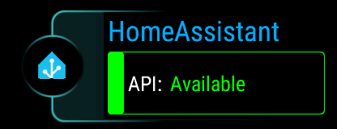
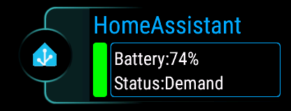
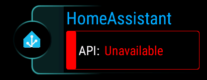
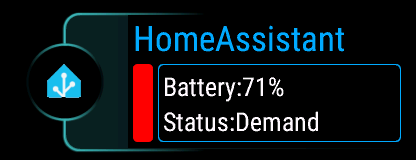

[Home](../README.md) | [Switches](Switches.md) | [Actions](Actions.md) | [Templates](Templates.md) | [Numeric](Numeric.md) | [Glance](Glance.md) | [Background Service](../BackgroundService.md) | [Wi-Fi](../Wi-Fi.md) | [HTTP Headers](../HTTP_Headers.md) | [Trouble Shooting](../TroubleShooting.md) | [Version History](../HISTORY.md)

# Glance

Since [version 2.30](../History.md), it is possible to override the text displayed on the Glance view. This page explains how to customise the text.

## Status View

The status view displays the accessibility of HomeAssistant API to indicate if there's a problem.



When API is inaccessible the field will turn red.

## Customised View

In order to customise the Glance view you need to add a `glance` field to the top level of the JSON menu file as illustrated here:

```json
{
  "$schema": "https://raw.githubusercontent.com/house-of-abbey/GarminHomeAssistant/main/config.schema.json",
  "title": "Home",
  "glance": {
    "type": "info",
    "content": "Text: "
  },
  "items": [...]
}
```

For example:



```json
{
  "$schema": "https://raw.githubusercontent.com/house-of-abbey/GarminHomeAssistant/main/config.schema.json",
  "glance": {
    "type": "info",
    "content": "Solar Battery: {{ states('sensor.battery_capacity_charge') }}%"
  },
  :
}
```

The 'status' view will persist showing until the API becomes available as without the API the custom template cannot be evaluated.

You may make this as complicated as you like! But you have limited space and only ASCII text characters. **It is essential to turn on menu caching in order to display of the template**. This is a change in v3.11 where multiple users are now making larger JSON menus than was originally envisaged for this watch application. As a result the Glance view would fail with an untrapable (fatal) _"Error: Out Of Memory Error"_. A work around is to pull out the glance subsection of the menu and cache that separately during execution of the full application, but that means any changes to the customised Glance view do not show until after the full application has been run.

> [!IMPORTANT]
> Sadly support for special characters like 🌞🔋⛅🪫 in the glance view is device dependent. For example they are not available on a Venu2 device but are available on a Venu X1 device. The application documentation shows them displaying in menu items. Only ASCII text appears to be universally supported by the Garmin Connect IQ (as you might hope). This is not something we have any control over, please do not request this to be "fixed".

It is possible to revert to the default glance content without deleting the template by changing the `type` to `status`.

```json
{
  "$schema": "https://raw.githubusercontent.com/house-of-abbey/GarminHomeAssistant/main/config.schema.json",
  "title": "Home",
  "glance": {
    "type": "status",
    "content": "Text: "
  },
  "items": [...]
}
```

So the glance view object has a `type` field with two possible values: `info` and `status`. When the type is `status` the `content` field is not required.

## Displayed Errors

The following shows the status Glance view when the API not available at the specified URL.



It is possible to loose connectivity with your HomeAssistant API after connecting and evaluating the Glance template. When the API connection is re-established, the Glance view will update.


