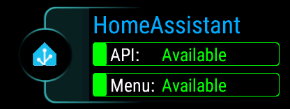
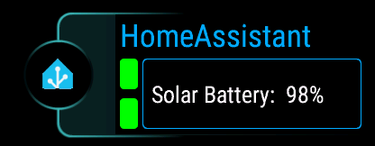
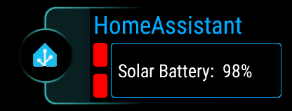

[Home](../README.md) | [Switches](Switches.md) | [Actions](Actions.md) | [Templates](Templates.md) | [Glance](Glance.md) | [Background Service](../BackgroundService.md) | [Wi-Fi](../Wi-Fi.md) | [Trouble Shooting](../TroubleShooting.md) | [Version History](../HISTORY.md)

# Glance

Since [version 2.30](../History.md), it is possible to ovverride the text displayed on the Glance view. This page explains how to customise the text.


## Default View

The default view has always been to display the status of the menu and API availability to indicate if there's a problem. This view has now been updated to be more colourful.



When either the API or the menu file is inaccessible, the fields will turn red.


## Customised View

In order to customise the Glance view you need to add a `glance` field to the top level of the JSON menu file as illustrated here:

```json
{
  "$schema": "https://raw.githubusercontent.com/house-of-abbey/GarminHomeAssistant/main/config.schema.json",
  "title": "Home",
  "glance": {
    "type": "info",
    "content": "Text: "
  },
  "items": [...]
}
```

For example:



```json
{
  "$schema": "https://raw.githubusercontent.com/house-of-abbey/GarminHomeAssistant/main/config.schema.json",
  "glance": {
    "type": "info",
    "content": "Solar Battery: {{ states('sensor.battery_capacity_charge') }}%"
  },
  :
}
```

You may make this as complicated as you like! But you have limited space and only ASCII text characters. **It is best to turn on menu caching in order to speed up the display of the template**. The display is then nearly instantaneous.

The default view will persist showing until the errors are resolved. In order to extract the custom glance template both the menu and the API are required. So it is logical that the two tests must pass first. The exception here is if the menu is cached, in which case only the API needs to pass.

> [!IMPORTANT]
> Sadly what you cannot do is use special characters like: 🌞🔋⛅🪫. Whilst these do display in menu items, they do not seem to work on the Glance view. We really like them, so have tried but failed. Only ASCII text appears to be supported by the Garmin Connect IQ SDK's Glance View. This is not something we have any control over, please do not request this to be "fixed".

It is possible to revert to the default glance content without deleting the template by changing the `type` to `status`.

```json
{
  "$schema": "https://raw.githubusercontent.com/house-of-abbey/GarminHomeAssistant/main/config.schema.json",
  "title": "Home",
  "glance": {
    "type": "status",
    "content": "Text: "
  },
  "items": [...]
}
```

So the glance view object has a `type` field with two possible values: `info` and `status`. When the type is `status` the `content` field is not required.


## Displayed Errors

The following shows the default glance when the menu file is not available at the specified URL.


Once the custom glance template has been retrieved and evaluated the display will change. Should the connectivity to your Home Assistant then be lost, e.g. you move out of range of your phone, the glance reflects this in the colour of the residual two rectangles. The top one remains an indicator for the API, and the bottom rectangle remains an indicator for the menu availability, reflecting the original placement in the default glance view that has now been replaced.


