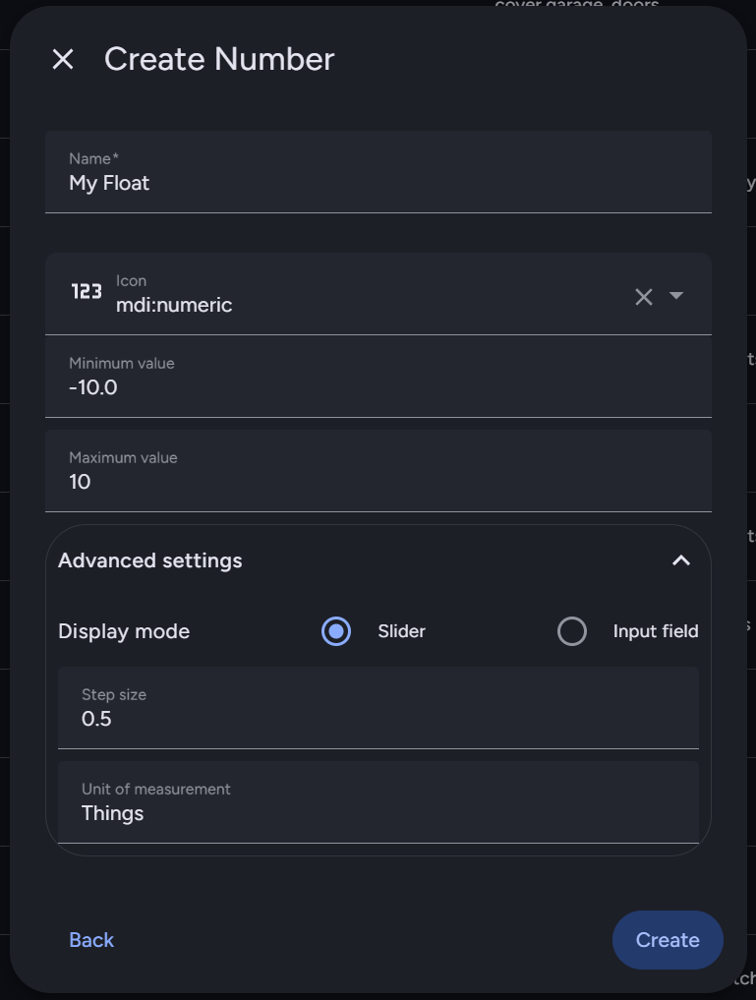
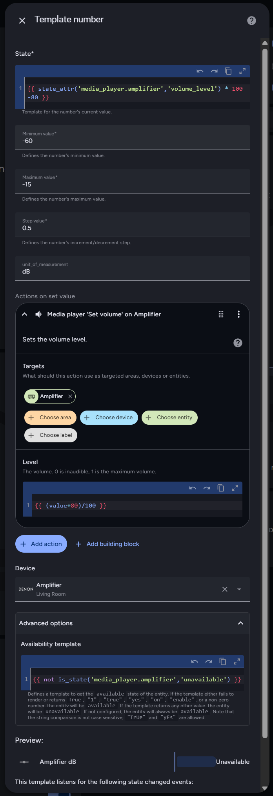

[Home](../README.md) | [Switches](Switches.md) | [Actions](Actions.md) | [Templates](Templates.md) | [Numeric](Numeric.md) | [Glance](Glance.md) | [Background Service](../BackgroundService.md) | [Wi-Fi](../Wi-Fi.md) | [HTTP Headers](../HTTP_Headers.md) | [Trouble Shooting](../TroubleShooting.md) | [Version History](../HISTORY.md)

# Numeric

Provides a number picker in order to adjust a numeric value of an entity.

## Thermostat

An example using a thermostat as a `numeric` menu item.

```json
{
  "name": "Heating",
  "content": "{{ ' %.1f' | format(state_attr('climate.room','temperature')) }}",
  "type": "numeric",
  "entity": "climate.room",
  "tap_action": {
    "service": "climate.set_temperature",
    "picker": {
        "step": 0.5,
        "min": 10,
        "max": 30,
        "attribute": "temperature",
        "data_attribute": "temperature"
    }
  }
}
```

This needs some explanation. The `tap_action` object needs a `picker` object to specify the numeric menu item's behaviour. The `picker` object is described in the table below.

Field            | Purpose                                                        | Mandatory |
-----------------|----------------------------------------------------------------|-----------|
`step`           | The increment or decrement step size.                          | Yes       |
`min`            | The minimum value the numeric entity can take.                 | Yes       |
`max`            | The maximum value the numeric entity can take.                 | Yes       |
`attribute`      | The attribute on the `entity` that holds the state to be read. | No        |
`data_attribute` | The attribute on the `service` call that sets the state.       | Yes       |

It may well be the case that often `attribute` and `data_attribute` are the same attribute, as with this example.

## Helper

You might define a "helper" entity as follows in Home Assistant:



In this case, the state is the actual value, so the template uses `states(..)` instead of `state_attr(..)`, you must not set the optional `attribute` value in the JSON definition so that the application uses the correct template internally for querying the HA server for its present value. Your own template definition in the `content` field will need to follow suit too. The `data_attribute` must be set to `value` for the service call that sets the chosen value from the number carousel.

```json
{
  "name": "My Float",
  "content": "Currently {{ states('input_number.my_float') }}",
  "type": "numeric",
  "entity": "input_number.my_float",
  "tap_action": {
    "service": "input_number.set_value",
    "picker": {
      "step": 0.5,
      "min": -10.0,
      "max": 10.0,
      "data_attribute": "value"
    }
  }
}
```

## Amplifier

The complication here is this amplifier uses one scale for changing the value, a range 0.0 to 1.0, and another to render the volume on the display, dB. So the template does some scale conversion, but the number picker has to use the 0.0 to 1.0 range which is annoying.

```json
{
  "name": "Amplifer Volume",
  "content": "{{ '%.1f' | format(state_attr('media_player.amplifier','volume_level') * 100 -80) }} dB ({{ state_attr('media_player.amplifier','volume_level') }})",
  "type": "numeric",
  "entity": "media_player.amplifier",
  "tap_action": {
    "service": "media_player.volume_set",
    "picker": {
        "step": 0.005,
        "min": 0.2,
        "max": 0.6,
        "attribute": "volume_level",
        "data_attribute": "volume_level"
    }
  }
}
```

The above is a little awkward to change the volume as the picker's scale is unfamiliar. To make life easier you might choose to implement a "Template number" in Home Assistant as defined in the following dialogue box.



For copy and paste, the Jinja2 fields are as follows:

1. Template rendering with conversion to dB:

```
{{ state_attr('media_player.amplifier','volume_level') * 100 -80 }}
```

2. Conversion from dB to range 0.0 to 1.0:

```
{{ (value+80)/100 }}
```

3. Availability template:

```
{{ not is_state('media_player.amplifier','unavailable') }}
```

The JSON menu definition can now use dB with the new template number as follows.

```json
{
  "name": "Amplifier Volume",
  "content": "Off{{ '%.1f' | format(states('number.amplifier_db') | float) }} dB",
  "type": "numeric",
  "entity": "number.amplifier_db",
  "tap_action": {
    "service": "number.set_value",
    "picker": {
        "step": 0.5,
        "min": -60.0,
        "max": -15.0,
        "data_attribute": "value"
    }
  }
},
```

## Trouble Shooting

Specific to this menu item:

1. If the number picker does not initialise with the correct value, amend the `attribute` field. Just because your template renders does not mean the application has extracted the numeric valueas the `content` template is rendered on the Home Assistant server.
