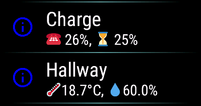

[Home](../README.md) | [Switches](Switches.md) | [Actions](Actions.md) | [Templates](Templates.md) | [Glance](Glance.md) | [Background Service](../BackgroundService.md) | [Wi-Fi](../Wi-Fi.md) | [HTTP Headers](../HTTP_Headers.md) | [Trouble Shooting](../TroubleShooting.md) | [Version History](../HISTORY.md)

# Templates

In order to provide the most functionality possible the content of the menu item comes from a user-defined template (i.e. you generate your own text). This allows you to do some pretty cool things. It also makes the configuration a bit more complicated. This page will help you understand how to use templates.

- In this file anything between `<` and `>` is a placeholder. Replace it with the appropriate value.
- [Jinja2](https://palletsprojects.com/p/jinja/) syntax is used by HomeAssistant [Templates](https://www.home-assistant.io/docs/configuration/templating/). Templates are used to dynamically insert values into the content. The syntax includes:
  - `` for Statements
  - `{{` ... `}}` for Expressions to print to the template output
  - `{#` ... `#}` for Comments not included in the template output

> [!IMPORTANT]
> In order to avoid "Template Error" being displayed as the return value, make sure your Jinja2 template returns a `string`, not a number of some variety. _All numbers must be formatted to strings_ so the application does not need to distinguish an `integer` from a `float`.

## States

In this example we get the battery level of the device and add the percent sign. *Very simple*

```json
{
  "name": "Phone",
  "type": "info",
  "content": "{{ states('sensor.<device>_battery_level') }}%"
}
```

### Examples

The first two keep to the simple proposal above. The last combines them into a single menu item. Now you can start to see the utility of this menu item, composing your own formatted text.

```json
{
  "name": "Hall Temp",
  "type": "info",
  "content": "{{ states('sensor.hallway_temperature') }}°C"
},
{
  "name": "Hall Humidity",
  "type": "info",
  "content": "{{ states('sensor.hallway_humidity') }}%"
},
{
  "name": "Hallway",
  "type": "info",
  "content": "{{ states('sensor.hallway_temperature') }}°C {{ states('sensor.hallway_humidity') }}%"
}
```

In order to keep the formatting of floating point numbers under control, you might also like to include a format string as follows. `states()` seems to return a `string` that needs converting to a `float` before the `format()` call can manage the conversion to the required number fo decimal places.

```json
{
  "name": "Hallway",
  "type": "info",
  "content": "T:{{ '%.1f' | format(states('sensor.hallway_temperature') | float) }}°C, H:{{ '%.1f' | format(states('sensor.hallway_humidity') | float) }}%"
},
```

Where your device supports unicode characters these example may work.

```json
{
  "name": "Charge",
  "type": "info",
  "content": "☎ {{ states('sensor.my_phone_battery_level') }}%⚡, ⏳ {{ '%.0f'|format(states('sensor.my_watch_battery_level') | float) }}%⚡"
},
{
  "name": "Hallway",
  "type": "info",
  "content": "🌡-{{ '%.1f'|format(states('sensor.hallway_temperature')|float) }}°C🔥, 💧-{{ '%.1f'|format(states('sensor.hallway_humidity')|float) }}%"
}
```



## Conditionals

Anything between `` is a directive (`if`, `else`, `elif`, `endif`, etc.). Conditionals are used to dynamically change the content based on the state of the entity.

In this example we get the battery level of the device and add the percent sign. If the device is charging we add a plus sign.

```json
{
  "name": "Phone",
  "type": "info",
  "content": "{{ states('sensor.<device>_battery_level') }}%+"
}
```

Here we also use the else clause as well to give proper text instead of just `on` or `off`.

```json
{
  "name": "Garage Doors",
  "type": "info",
  "content": "OpenClosed OpenClosed"
}
```

> [!IMPORTANT]
> We advise users against adding security devices.

However, for users doing this **against our advice**, we strongly recommend to secure confirmation of the action using our PIN confirmation dialog.
This an example of toggling a garage door open and closed with a PIN confirmation. *Do this at your own risk*.

The PIN confirmation is activated for actions with `"pin": true`. The PIN is configured globally in the application settings. The PIN needs to be a 4-digit number.
The user has 5 attempts to provide a valid PIN within 2 minutes. If too many failures have been detected during this time, the PIN dialog will be locked for 10 minutes.

Note: Only when you use the `tap_action` field do you also need to include the `entity` field. This is a change to a previous version of the application, hence the presence of the `entity` field will be ignored for backwards compatibility, and the schema will provide a warning only.

```json
{
  "entity": "cover.garage_door",
  "name": "Garage Door",
  "type": "tap",
  "content": "{{state_translated('cover.garage_door')}} - {{state_attr('cover.garage_door', 'current_position')}}%Unconnected",
  "tap_action": {
    "action": "cover.toggle",
    "pin": true
  }
}
```

## Group and Toggle Menu Items

Both `group` and `toggle` menu items accept an optional `content` field as of v2.19. This allows the use of templates to present status information.

```json
    {
      "name": "Each Lounge Light",
      "title": "Lounge",
      "type": "group",
      "content": "{{'On: %d, Off: %d'|format(expand(state_attr('light.living_room_lights', 'entity_id'))|selectattr('state','eq','on')|map(attribute='entity_id')|list|count, expand(state_attr('light.living_room_lights', 'entity_id'))|selectattr('state','eq','off')|map(attribute='entity_id')|list|count)}}",
      "items": [..]
    }
```

## Advanced

Here we generate a bar graph of the battery level. We use the following steps to do this:

- Convert the state to a number.
- Divide by 100 to get a fraction.
- Multiply by the width to get the number of `#`s.
- Multiply by the `#` char to make a string.
- Subtract the width from the number of `#`s to get the number of `_`s.
- Multiply by the `_` char to make a string.

```json
{
  "name": "Phone",
  "type": "info",
  "content": "{{ states('sensor.<device>_battery_level') }}%+ {{ '#' * (((states('sensor.<device>_battery_level') | int) / 100 * <width>) | int) }}{{ '_' * (<width> - (((states('sensor.<device>_battery_level') | int) / 100 * <width>) | int)) }}"
}
```

An example of a dimmer light with 4 brightness settings 0..3. Here our light worked on a percentage, so that had to be converted to the range 0..3.

```json
{
  "$schema": "https://raw.githubusercontent.com/house-of-abbey/GarminHomeAssistant/main/config.schema.json",
  "title": "Home",
  "items": [
    {
      "name": "LEDs",
      "type": "info",
      "content": "{{ (((state_attr('light.green_house', 'brightness') | float) / 255 * 100) | round(0)) | int }}%Off"
    },
    {
      "entity": "light.green_house",
      "name": "LEDs 0",
      "type": "tap",
      "content": "{{ (((state_attr('light.green_house', 'brightness') | float) / 255 * 100) | round(0)) | int }}%Off",
      "tap_action": {
        "action": "light.turn_on",
        "data": {
          "brightness_pct": 12
        }
      }
    },
    {
      "entity": "light.green_house",
      "name": "LEDs 1",
      "type": "tap",
      "tap_action": {
        "action": "light.turn_on",
        "data": {
          "brightness_pct": 37
        }
      }
    },
    {
      "entity": "light.green_house",
      "name": "LEDs 2",
      "type": "tap",
      "content": "{{ (((state_attr('light.green_house', 'brightness') | float) / 255 * 100) | round(0)) | int }}%Off",
      "tap_action": {
        "action": "light.turn_on",
        "data": {
          "brightness_pct": 62
        }
      }
    },
    {
      "entity": "light.green_house",
      "name": "LEDs 3",
      "type": "tap",
      "content": "{{ (((state_attr('light.green_house', 'brightness') | float) / 255 * 100) | round(0))| int }}%Off",
      "tap_action": {
        "action": "light.turn_on",
        "data": {
          "brightness_pct": 87
        }
      }
    }
  ]
}
```

## Disable Menu Item

If you would like to temporarily disable an item in your menu, then rather than swapping menu definition files or deleting a section of the menu you can mark the item as 'disabled'. This field applies to all menu items.

```json
{
  "name": "Phone",
  "type": "info",
  "content": "{{ ... }}",
  "enabled": false
}
```

## Warnings

Just remember, on older smaller memory devices **you have the ability to crash the application by creating an excessive menu definition**. Templates can require significant definition for highly customised text. Don't be silly.
